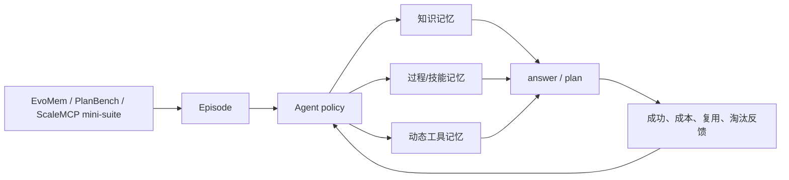

# Agent 论文研究

这个子模块面向 Agent 的记忆、规划、工具使用和自我进化论文。首批实现刻意不依赖
付费模型 API：用确定性 mini-suite 验证状态更新、跨 episode 复用和工具上下文管理，
之后可把同一方法接到真实 LLM executor。



评测沿用 EvoMemBench 的四象限：in-episode / cross-episode 与
knowledge / execution。`planbench-mini` 强调可验证计划，
`scalemcp-mini` 强调有限上下文里的动态工具集合。它们是仓库自带的确定性
mini-suite，并非原 benchmark 的完整数据或论文分数。

## 已实现方法

### U-Mem

- 论文：[Towards Autonomous Memory Agents](https://arxiv.org/abs/2602.22406)
- 作者机构：National University of Singapore
- 首次公开日期：2026-02-25
- 原作者代码：[匿名审稿仓库](https://anonymous.4open.science/r/code-release-456D/)（论文仍在匿名阶段）
- 本地方法键：`u-mem`
- 本地代码：`src/auto_research/agent_research/methods.py`

U-Mem 把被动存取改为主动知识获取：低置信时沿 self/teacher、tool research、
expert 逐级升级，并将获取成本计入评测。检索用语义相似度和 Thompson sampling
联合打分，兼顾复用与冷启动探索。论文报告 HotpotQA +14.6 points、AIME25 +7.33 points。

### LEGOMem

- 论文：[arXiv 2510.04851](https://arxiv.org/abs/2510.04851)
- 作者机构：Microsoft Research
- 首次公开日期：2025-10-06
- 原作者代码：截至 2026-07-27 未在论文页发布
- 本地方法键：`legomem`
- 本地代码：`src/auto_research/agent_research/methods.py`

LEGOMem 将成功轨迹拆成可组合的 procedural units：orchestrator 复用任务分解，
执行 Agent 复用细粒度动作模板。本地实现会把计划泛化为 action/domain 单元，
并单独统计 `reused_plans`。

### MemTool

- 论文：[arXiv 2507.21428](https://arxiv.org/abs/2507.21428)
- 作者机构：PricewaterhouseCoopers Commercial Technology and Innovation Office
- 首次公开日期：2025-07-29
- 原作者代码：截至 2026-07-27 未在论文页发布
- 本地方法键：`memtool`
- 本地代码：`src/auto_research/agent_research/methods.py`

MemTool 解决多轮任务中工具/MCP 描述占满短期上下文的问题。实现采用 hybrid
策略：工作流当前必需工具受保护，其余工具按近期性和成功率淘汰；报告保存
tool evictions、plan success 和每 episode 平均上下文成本。

## 运行

```bash
auto-research agent-eval --method u-mem --benchmark evomem-mini
auto-research agent-eval --method legomem --benchmark planbench-mini
auto-research agent-eval --method memtool --benchmark scalemcp-mini \
  --episodes 200 --memory-size 8

# 公平长上下文基线
auto-research agent-eval --method long-context --benchmark evomem-mini
```

产物写入 `runs/agent-research/<method>-<benchmark>-seed<seed>/`，包括逐步 trace、
汇总 `metrics.json` 和中文 `report.md`。

## 本地 mini-suite 结果

固定 120 episodes、seed 42。长上下文与方法机制的任务成功率都较高，区别主要体现在
上下文/获取成本和可解释的复用状态；这些数字不能与论文的 HotpotQA、OfficeBench
或 ScaleMCP 指标横向比较。

| 方法与 benchmark | joint success | 平均成本 | 额外诊断 |
|---|---:|---:|---|
| Long-context · EvoMem mini | 1.0000 | 64.5000 | 上下文成本随历史线性增长 |
| U-Mem · EvoMem mini | 1.0000 | 3.0500 | 检索后验证，失败则升级 tool research |
| LEGOMem · PlanBench mini | 1.0000 | 1.1200 | 过程单元跨 episode 复用 |
| MemTool · ScaleMCP mini | 1.0000 | 1.9812 | 受限工具上下文动态淘汰 |

可机读的稳定指标保存在
[`docs/experiments/agent-mini-suites-seed42.json`](experiments/agent-mini-suites-seed42.json)。
