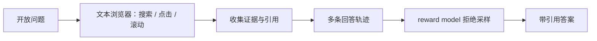
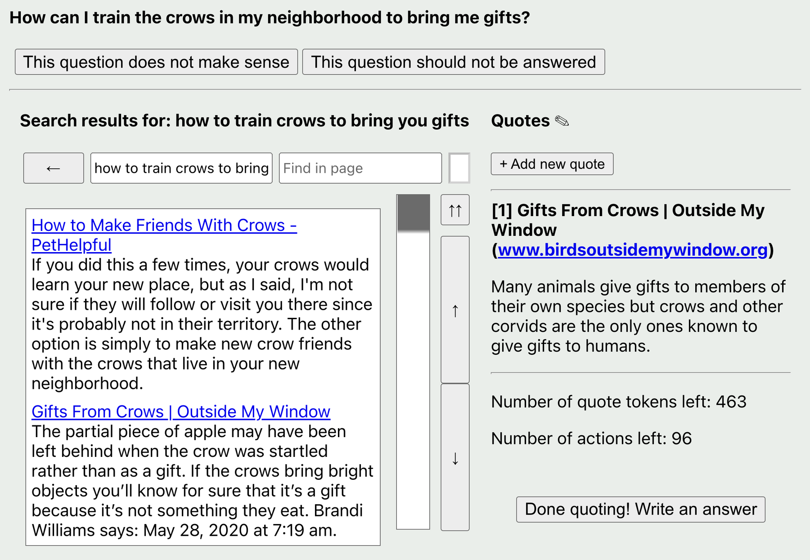

# WebGPT：带引用约束的浏览问答

> 本页复现文本浏览轨迹、证据引用和 reward-model 拒绝采样；本地确定性工具环境
> 不是实时互联网浏览。

## 论文信息

| 字段 | 内容 |
|---|---|
| 论文链接 | [WebGPT](https://arxiv.org/abs/2112.09332) |
| 公司 / 机构 | OpenAI |
| 首次公开日期 | 2021-12-17 |
| 原作者代码 | 未发布完整训练代码；[WebGPT comparisons 数据集](https://huggingface.co/datasets/openai/webgpt_comparisons) 已公开 |
| 本地 adapter / CLI key | `webgpt` |
| 本地复现代码 | `src/auto_research/agent_research/` |

## 原始论文总结

### 背景与主要改动

长文本问答容易幻觉，且很难核查依据。WebGPT 让模型在文本浏览器里搜索、点击和
滚动，回答必须收集引用；训练先做行为克隆，再用人类偏好 reward model 从多条
浏览/回答轨迹中做拒绝采样。



<!-- paper-figure:start -->
### 原论文关键图

[](https://ar5iv.labs.arxiv.org/html/2112.09332/assets/images/demo_website.png)

> **原论文 Figure 1（关键图）**：展示原论文方法的总体设计和关键组成。图片来自[原论文](https://arxiv.org/abs/2112.09332)，版权归原作者所有；点击图片可查看来源。
<!-- paper-figure:end -->

### 核心公式

$$
\tau^\star=\arg\max_{\tau_i\sim\pi_\theta}
r_\phi(x,\tau_i),\qquad
\tau=(a_1,o_1,\ldots,a_T,o_T,y,\mathcal C).
$$

### 论文离线与线上效果

175B best-of-64 回答在人评中以 56% 胜过人类示范、以 69% 胜过 Reddit
最高票答案；TruthfulQA 的 true 为 75%，true-and-informative 为 54%。
论文没有生产线上 A/B。

## 本地复现

ScaleMCP mini 120 episodes、seed 42；每题生成两条工具轨迹，按证据覆盖选择。

| 指标 | Long-context 基线 | WebGPT |
|---|---:|---:|
| joint success | 1.0000 | 1.0000 |
| average cost | 64.5000 | **3.0000** |
| references / candidates | 0 / 0 | 600 / 240 |

```bash
auto-research agent-eval --method webgpt --benchmark scalemcp-mini \
  --episodes 120 --memory-size 24 --seed 42
```

稳定指标：
[`p1-agent-candidates-mini-suites-seed42.json`](../../experiments/p1-agent-candidates-mini-suites-seed42.json)。

## 复现边界

保留 browser-action、citation constraint 和 trajectory rejection sampling；不访问
实时网页、不训练 GPT-3/reward model，也不复刻 ELI5 人评。
