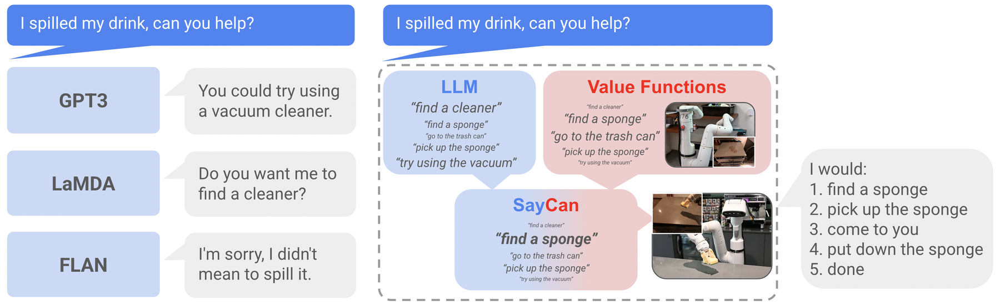

# SayCan：语言相关性与可执行性联合规划

> 本页复现逐步技能枚举及“语言分数 × affordance”决策，不把确定性工具
> mini-suite 冒充真实移动机械臂。

## 论文信息

| 字段 | 内容 |
|---|---|
| 论文链接 | [SayCan](https://arxiv.org/abs/2204.01691) |
| 公司 / 机构 | Robotics at Google / Everyday Robots |
| 首次公开日期 | 2022-04-04 |
| 原作者代码 | [模拟 tabletop 实现](https://github.com/google-research/google-research/tree/master/saycan) |
| 本地 adapter / CLI key | `saycan` |
| 本地复现代码 | `src/auto_research/agent_research/` |

## 原始论文总结

### 背景与主要改动

LLM 知道“应该做什么”，却不知道当前机器人“能不能做”。SayCan 为每个预训练技能
同时计算语言相关性和 value-function affordance，选择乘积最高的技能并执行，再把
动作追加到上下文继续规划。


<!-- paper-figure:start -->
### 原论文关键图

[](https://ar5iv.labs.arxiv.org/html/2204.01691/assets/figures/intro.png)

> **原论文 Figure 1（关键图）**：展示原论文方法的总体设计和关键组成。图片来自[原论文](https://arxiv.org/abs/2204.01691)，版权归原作者所有；点击图片可查看来源。
<!-- paper-figure:end -->

### 核心公式

$$
\pi(s\mid i,h,e)\propto
p_{\mathrm{LM}}(s\mid i,h)\,
p_{\mathrm{aff}}(\mathrm{success}\mid s,e).
$$

### 论文离线与线上效果

PaLM-SayCan 在 101 个机器人任务上达到 84% plan success 和 74% execution
success；FLAN-SayCan 分别为 70% 和 61%。这是实体机器人评测，不是生产 A/B。

## 本地复现

PlanBench mini 120 episodes、seed 42；每一步同时打分必要技能和干扰技能。

| 指标 | Long-context 基线 | SayCan |
|---|---:|---:|
| joint success | 1.0000 | 1.0000 |
| average cost | 64.5000 | **3.3750** |
| affordance checks | 0 | 1350 |
| infeasible filtered | 0 | 790 |

```bash
auto-research agent-eval --method saycan --benchmark planbench-mini \
  --episodes 120 --memory-size 24 --seed 42
```

稳定指标：
[`p1-agent-candidates-mini-suites-seed42.json`](../../experiments/p1-agent-candidates-mini-suites-seed42.json)。

## 复现边界

保留双分数逐步规划与不可行技能过滤；affordance 是确定性本地可执行性，不含视觉、
机器人控制策略或真实 value-function 训练。
