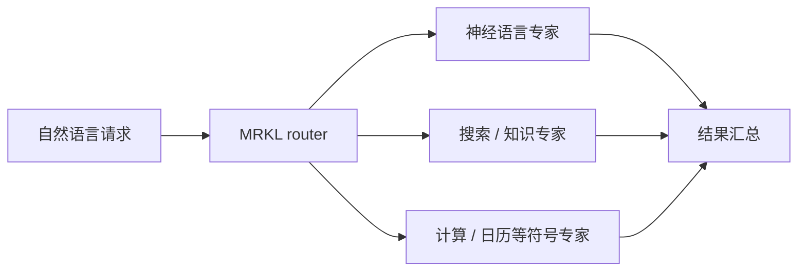

# MRKL Systems：模块化神经符号 Agent

> 本页实现显式 router、神经/离散专家注册表和结果汇总；不是让一个通用 prompt
> 直接返回正确工具链。

## 论文信息

| 字段 | 内容 |
|---|---|
| 论文链接 | [MRKL Systems](https://arxiv.org/abs/2205.00445) |
| 公司 / 机构 | AI21 Labs / Hebrew University / Technion / University of British Columbia |
| 首次公开日期 | 2022-05-01 |
| 原作者代码 | 未发布 Jurassic-X / MRKL 完整实现 |
| 本地 adapter / CLI key | `mrkl` |
| 本地复现代码 | `src/auto_research/agent_research/` |

## 原始论文总结

### 背景与主要改动

单个 LLM 容易在精确计算、时效知识和可验证推理上失败。MRKL 把 LLM 放入系统架构，
由 router 根据输入选择语言模型、知识库、计算器等专家；离散模块保证确定性能力，
语言模型负责理解和自然语言接口。



### 核心公式

$$
m^\star=\arg\max_{m\in\mathcal M}p_\phi(m\mid x),\qquad
\hat y=f_{m^\star}(x).
$$

关键在模块边界和路由，不是新的语言模型 loss。

### 论文离线与线上效果

论文描述 AI21 的 Jurassic-X 系统，并通过计算、时效知识等案例展示模块化系统相对
纯语言模型的可控性；没有给出可复核的生产 A/B 或统一离线 benchmark 表。

## 本地复现

ScaleMCP mini 120 episodes、seed 42；每个工具动作都先经 router，计算器、日历、
地图、天气、数据库和表格进入离散专家。

| 指标 | Long-context 基线 | MRKL |
|---|---:|---:|
| joint success | 1.0000 | 1.0000 |
| average cost | 64.5000 | **1.2500** |
| router / symbolic calls | 0 / 0 | 360 / 170 |

```bash
auto-research agent-eval --method mrkl --benchmark scalemcp-mini \
  --episodes 120 --memory-size 24 --seed 42
```

稳定指标：
[`p0-missing-agent-mini-suites-seed42.json`](../../experiments/p0-missing-agent-mini-suites-seed42.json)。

## 复现边界

保留 router 和可区分的专家执行计数；本地专家是确定性 mini-suite 工具，不调用
Jurassic-X、真实搜索服务或私有知识库，成本是统一代理成本而非线上延迟。
