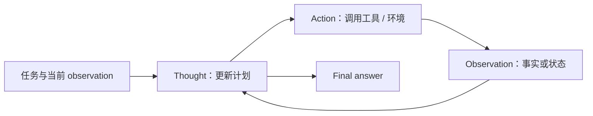
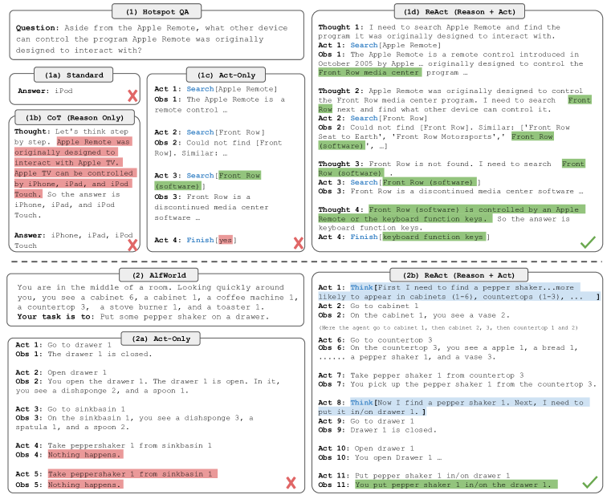

# ReAct

> 本页实现 Thought → Action → Observation 的交替循环，并记录实际 reasoning/action
> 次数；不是把直接返回答案包装成 ReAct。

## 论文信息

| 字段 | 内容 |
|---|---|
| 论文链接 | [ReAct: Synergizing Reasoning and Acting in Language Models](https://arxiv.org/abs/2210.03629) |
| 公司 / 机构 | Princeton University / Google Research |
| 首次公开日期 | 2022-10-06 |
| 原作者代码 | [已开源](https://github.com/ysymyth/ReAct) |
| 本地 adapter / CLI key | `react` |
| 本地复现代码 | `src/auto_research/agent_research/` |

## 原始论文总结

### 背景与主要改动

纯 CoT 容易在封闭知识上幻觉，纯 action agent 又缺少计划与状态跟踪。ReAct 让模型
交替生成自然语言推理和环境 action，再把 observation 放回下一步上下文，使推理
可以纠错、行动可以获取外部事实。



<!-- paper-figure:start -->
### 原论文关键图

[](https://ar5iv.labs.arxiv.org/html/2210.03629/assets/x1.png)

> **原论文 Figure 1（关键图）**：展示原论文方法的总体设计和关键组成。图片来自[原论文](https://arxiv.org/abs/2210.03629)，版权归原作者所有；点击图片可查看来源。
<!-- paper-figure:end -->

### 核心公式

$$
\tau=(o_0,t_1,a_1,o_1,\ldots,t_T,a_T,o_T),\qquad
(t_i,a_i)\sim\pi_\theta(\cdot\mid o_{\le i-1},t_{<i},a_{<i}).
$$

关键不是新 loss，而是把 reasoning trace 与可执行 action 统一进同一条轨迹。

### 论文离线与线上效果

论文在 ALFWorld、WebShop 上相对 imitation/RL baseline 的成功率分别绝对提升
34、10 个百分点，并在 HotpotQA/FEVER 通过 Wikipedia API 降低幻觉。没有生产
线上 A/B 实验。

## 本地复现

ScaleMCP mini 固定 120 episodes、seed 42；每个 required tool 前执行一次 reasoning，
随后记录 action/observation。

| 指标 | ReAct |
|---|---:|
| joint success | **1.0000** |
| average cost | 3.0000 |
| reasoning steps / actions | 360 / 360 |

```bash
auto-research agent-eval --method react --benchmark scalemcp-mini \
  --episodes 120 --memory-size 24 --seed 42
```

稳定指标：
[`classic-agent-mini-suites-seed42.json`](../../experiments/classic-agent-mini-suites-seed42.json)。

## 复现边界

保留交替 trace 和工具动作计数，但 observation 来自确定性 mini-suite；未调用
Wikipedia、WebShop 或付费 LLM，因此本地 1.0 只说明执行循环正确，不能对标论文。
