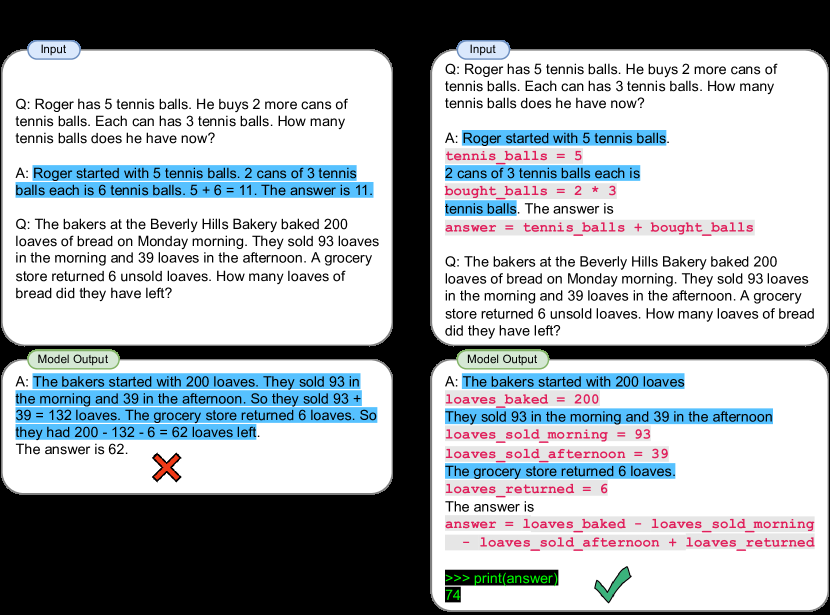

# PAL：让程序解释器完成精确推理

> 本页复现“语言模型生成程序、符号 runtime 执行、返回解释器答案”的系统边界，
> 不把结构化 task program 写成 Codex 生成代码。

## 论文信息

| 字段 | 内容 |
|---|---|
| 论文链接 | [PAL](https://arxiv.org/abs/2211.10435) |
| 公司 / 机构 | Carnegie Mellon University / Inspired Cognition |
| 首次公开日期 | 2022-11-18 |
| 原作者代码 | [reasoning-machines/pal](https://github.com/reasoning-machines/pal) |
| 本地 adapter / CLI key | `pal` |
| 本地复现代码 | `src/auto_research/agent_research/` |

## 原始论文总结

### 背景与主要改动

LLM 擅长把问题分解成步骤，却会在算术和符号执行阶段出错。PAL 让 LLM 输出带变量
和控制流的程序，最终计算完全交给 Python 等确定性 runtime；模型只承担自然语言
理解和程序合成。


<!-- paper-figure:start -->
### 原论文关键图

[](https://ar5iv.labs.arxiv.org/html/2211.10435/assets/x1.png)

> **原论文 Figure 1（关键图）**：展示原论文方法的总体设计和关键组成。图片来自[原论文](https://arxiv.org/abs/2211.10435)，版权归原作者所有；点击图片可查看来源。
<!-- paper-figure:end -->

### 核心公式

$$
z\sim p_\theta(z\mid x,\mathcal D_{\mathrm{demo}}),
\qquad \hat y=\operatorname{Exec}(z).
$$

### 论文离线与线上效果

PAL 在 13 个算术、符号和算法任务上评测；Codex+PAL 的 GSM8K top-1 比
PaLM-540B chain-of-thought 高 15 个百分点。论文没有生产线上 A/B。

## 本地复现

ScaleMCP mini 120 episodes、seed 42；每题实际构建 CALL/RETURN 程序并由本地
解释器执行。

| 指标 | Long-context 基线 | PAL |
|---|---:|---:|
| joint success | 1.0000 | 1.0000 |
| average cost | 64.5000 | **1.4000** |
| programs / interpreter calls | 0 / 0 | 120 / 120 |

```bash
auto-research agent-eval --method pal --benchmark scalemcp-mini \
  --episodes 120 --memory-size 24 --seed 42
```

稳定指标：
[`p1-agent-candidates-mini-suites-seed42.json`](../../experiments/p1-agent-candidates-mini-suites-seed42.json)。

## 复现边界

保留神经程序生成与符号执行的职责分离；本地使用受控中间表示而非任意 Python，
不调用 Codex，也未复刻原论文 GSM8K。
