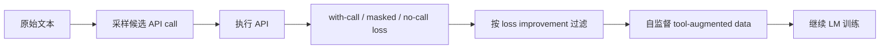
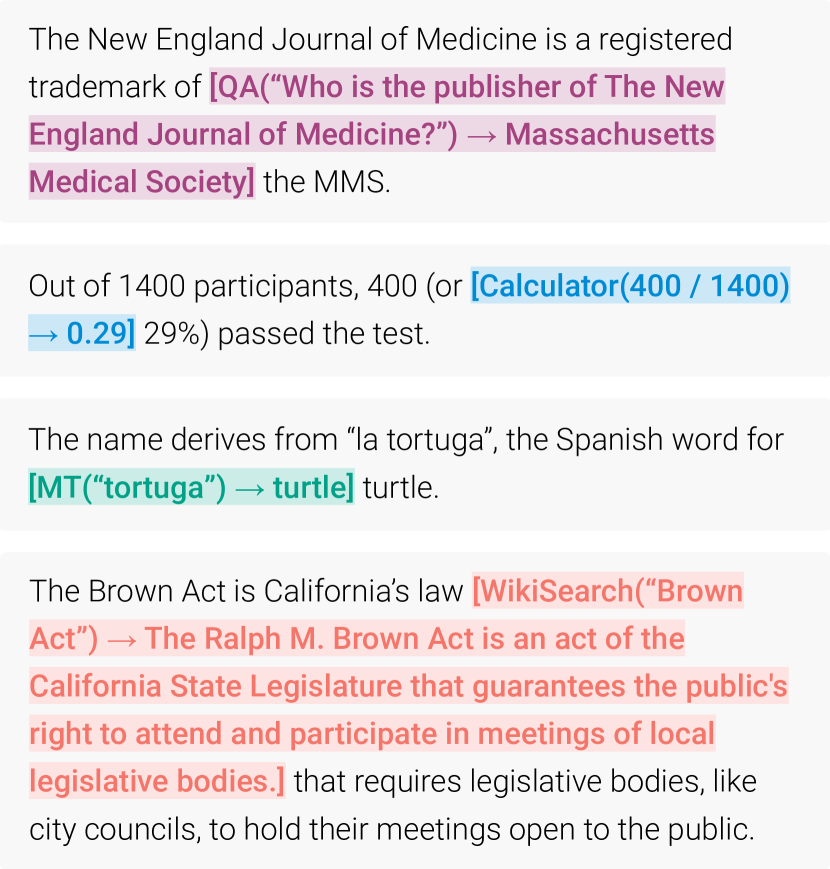

# Toolformer

> 本页实现候选 API call 生成、no-call/masked-call loss 对照和自监督过滤，只保留
> 能降低预测 loss 的工具调用。

## 论文信息

| 字段 | 内容 |
|---|---|
| 论文链接 | [Toolformer: Language Models Can Teach Themselves to Use Tools](https://arxiv.org/abs/2302.04761) |
| 公司 / 机构 | Meta AI Research / Universitat Pompeu Fabra |
| 首次公开日期 | 2023-02-09 |
| 原作者代码 | 未发布官方训练代码；公开 GitHub 实现均为第三方 |
| 本地 adapter / CLI key | `toolformer` |
| 本地复现代码 | `src/auto_research/agent_research/` |

## 原始论文总结

### 背景与主要改动

手工标注工具调用昂贵，纯 prompting 又难以让较小模型稳定决定何时调用。Toolformer
先用少量 demonstration 采样 API call，再比较插入真实返回值、隐藏返回值和完全
不调用时的后续 token loss，只保留确实有用的调用并继续语言模型训练。



<!-- paper-figure:start -->
### 原论文关键图

[](https://ar5iv.labs.arxiv.org/html/2302.04761/assets/x1.png)

> **原论文 Figure 1（关键图）**：展示原论文方法的总体设计和关键组成。图片来自[原论文](https://arxiv.org/abs/2302.04761)，版权归原作者所有；点击图片可查看来源。
<!-- paper-figure:end -->

### 核心公式

$$
L_i(z)= -\sum_{j=i}^{n}\log p(x_j\mid x_{<j},z),\qquad
\Delta_i=L_i(\varnothing)-L_i(\text{API call + result}),
$$

仅当 $\Delta_i$ 超过阈值，候选调用才进入训练数据。

### 论文离线与线上效果

论文用 6.7B GPT-J 在多个零样本任务中显著超过未增强 GPT-J，并在部分任务超过
更大的 GPT-3，同时保持普通语言建模能力。没有生产线上 A/B 实验。

## 本地复现

ScaleMCP mini 对 required 和 distractor tools 都生成候选，只有相对 no-call
降低 loss 的调用被接受。

| 指标 | Toolformer |
|---|---:|
| joint success | **1.0000** |
| average cost | 3.0000 |
| candidate / accepted calls | 540 / 360 |

```bash
auto-research agent-eval --method toolformer \
  --benchmark scalemcp-mini --episodes 120 --seed 42
```

稳定指标：
[`classic-agent-mini-suites-seed42.json`](../../experiments/classic-agent-mini-suites-seed42.json)。

## 复现边界

实现自监督候选过滤的核心判据，但 loss 来自确定性 tool utility，不是 GPT-J token
loss；未进行 6.7B continued training，也未复刻论文五类真实 API。
