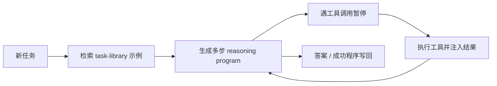

# ART：自动多步推理与工具使用

> 本页复现任务库检索、程序式多步推理、工具调用处暂停/恢复和成功示例写回，
> 不把 mini-suite 写成完整 BIG-Bench/MMLU。

## 论文信息

| 字段 | 内容 |
|---|---|
| 论文链接 | [ART](https://arxiv.org/abs/2303.09014) |
| 公司 / 机构 | University of Washington / UC Irvine / Meta AI |
| 首次公开日期 | 2023-03-16 |
| 原作者代码 | [bhargaviparanjape/language-programmes](https://github.com/bhargaviparanjape/language-programmes) |
| 本地 adapter / CLI key | `art` |
| 本地复现代码 | `src/auto_research/agent_research/` |

## 原始论文总结

### 背景与主要改动

既有 tool-use prompting 常需为每个任务手写示例和调用顺序。ART 根据新任务自动
检索相近的推理/工具示例，让冻结 LLM 生成程序；运行器遇到工具标记就暂停生成，
执行工具并注入结果后继续。人可以用少量修订扩展任务库。



### 核心公式

$$
d^\star=\arg\max_{d\in\mathcal D}\operatorname{sim}(x,d),
\qquad
z\sim p_\theta(z\mid x,d^\star),\quad
y=\operatorname{ExecTools}(z).
$$

### 论文离线与线上效果

ART 在未见 BIG-Bench 与 MMLU 任务上显著优于 few-shot 和 automatic CoT，并在
多数任务上达到手写 CoT 水平；对每个任务只修订 5 个错误程序即可进一步明显提升。
论文没有生产线上 A/B。

## 本地复现

PlanBench mini 120 episodes、seed 42；按工具签名组织任务库，并逐工具暂停/恢复。

| 指标 | Long-context 基线 | ART |
|---|---:|---:|
| joint success | 1.0000 | 1.0000 |
| average cost | 64.5000 | **1.5500** |
| examples retrieved | 0 | 108 |
| pauses / library updates | 0 / 0 | 360 / 12 |

```bash
auto-research agent-eval --method art --benchmark planbench-mini \
  --episodes 120 --memory-size 24 --seed 42
```

稳定指标：
[`p1-agent-candidates-mini-suites-seed42.json`](../../experiments/p1-agent-candidates-mini-suites-seed42.json)。

## 复现边界

保留自动示例检索、程序生成控制流、工具暂停和库更新；本地任务库很小，不调用冻结
大模型，也未复刻 BIG-Bench/MMLU 原始分数。
