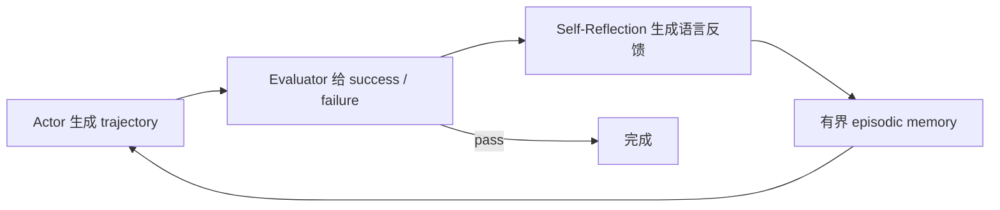

# Reflexion

> 本页实现失败反馈 → 语言反思 → 有界 episodic memory → 下一 trial 改进，
> 全程不更新模型权重。

## 论文信息

| 字段 | 内容 |
|---|---|
| 论文链接 | [Reflexion: Language Agents with Verbal Reinforcement Learning](https://arxiv.org/abs/2303.11366) |
| 公司 / 机构 | Northeastern University / MIT / Princeton University |
| 首次公开日期 | 2023-03-20 |
| 原作者代码 | [已开源](https://github.com/noahshinn/reflexion) |
| 本地 adapter / CLI key | `reflexion` |
| 本地复现代码 | `src/auto_research/agent_research/` |

## 原始论文总结

### 背景与主要改动

传统 RL 要大量采样与参数更新。Reflexion 把稀疏标量/二值反馈“放大”为可执行的
自然语言经验，写入长期 episodic memory；Actor 在下一 trial 读取反思，Evaluator
继续判定成功与否。



### 核心公式

$$
\tau_t\sim\pi_\theta(\cdot\mid x,\mathrm{mem}_t),\quad
r_t=M_e(\tau_t),\quad
sr_t=M_{sr}(\tau_t,r_t),\quad
\mathrm{mem}_{t+1}=\operatorname{BoundedAppend}(\mathrm{mem}_t,sr_t).
$$

这里的“verbal reinforcement”改变上下文策略，不做梯度下降。

### 论文离线与线上效果

论文报告 HumanEval pass@1 91%，高于当时 GPT-4 的 80%；相对强基线在
ALFWorld、HotpotQA、HumanEval 分别提升 22、20、11 个百分点。没有生产线上
A/B 实验。

## 本地复现

PlanBench mini 有 12 个重复任务族。每族首次暴露计划错误，Evaluator 失败后生成
一条可复用反思；后续 episode 读取当前上下文并执行完整计划。

| 指标 | Reflexion |
|---|---:|
| joint success | **0.9000** |
| average cost | 1.1000 |
| reflections / reused trials | 12 / 108 |

```bash
auto-research agent-eval --method reflexion --benchmark planbench-mini \
  --episodes 120 --memory-size 24 --seed 42
```

稳定指标：
[`classic-agent-mini-suites-seed42.json`](../../experiments/classic-agent-mini-suites-seed42.json)。

## 复现边界

实现跨 trial 的失败、语言经验与复用闭环，但反思模板和 evaluator 是确定性的；
没有调用 GPT-4、ALFWorld、HotpotQA 或代码执行器。0.9 来自“每个新族首次失败”的
可审计协议，不等同 HumanEval pass@1。
