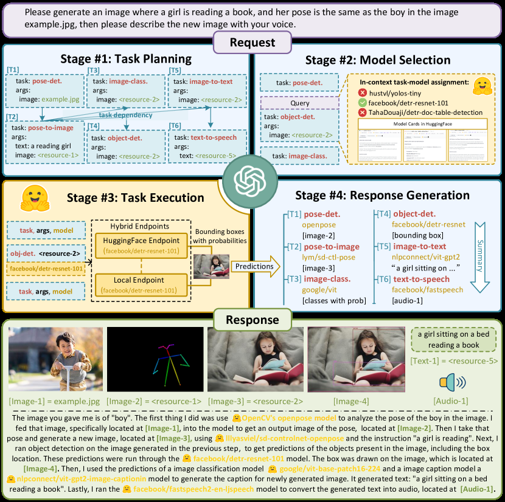

# HuggingGPT：LLM 控制器编排专家模型

> 本页实现 task planning、按能力描述选择模型、依赖图执行和最终汇总四阶段。

## 论文信息

| 字段 | 内容 |
|---|---|
| 论文链接 | [HuggingGPT: Solving AI Tasks with ChatGPT and its Friends in Hugging Face](https://arxiv.org/abs/2303.17580) |
| 公司 / 机构 | Zhejiang University / Microsoft Research Asia |
| 首次公开日期 | 2023-03-30 |
| 原作者代码 | [已开源（JARVIS）](https://github.com/microsoft/JARVIS) |
| 本地 adapter / CLI key | `hugginggpt` |
| 本地复现代码 | `src/auto_research/agent_research/` |

## 原始论文总结

### 背景与主要改动

单个 LLM 难以覆盖视觉、语音和其他专业任务，而模型社区已有大量专家。HuggingGPT
让 ChatGPT 充当控制器：先把请求拆成带依赖的子任务，再按 Hugging Face 模型描述
匹配专家，按拓扑顺序执行，最后把多模型输出组织为用户答案。


<!-- paper-figure:start -->
### 原论文关键图

[](https://ar5iv.labs.arxiv.org/html/2303.17580/assets/x2.png)

> **原论文 Figure 2（关键图）**：展示原论文的整体流程、关键阶段及其数据流向。图片来自[原论文](https://arxiv.org/abs/2303.17580)，版权归原作者所有；点击图片可查看来源。
<!-- paper-figure:end -->

### 核心公式

$$
G=(V,E)=\operatorname{Plan}(x),\qquad
m_v=\arg\max_m \operatorname{match}(d_v,c_m),\qquad
o_v=f_{m_v}(o_{\mathrm{pa}(v)}).
$$

### 论文离线与线上效果

论文用语言、视觉、语音和跨模态案例展示复杂任务编排能力，主要是系统案例与定性
评估，没有生产线上 A/B 实验。

## 本地复现

PlanBench mini 120 episodes、seed 42；工具描述充当本地模型 capability registry，
每个子任务保留 dependency edge 后执行。

| 指标 | Long-context 基线 | HuggingGPT |
|---|---:|---:|
| joint success | 1.0000 | 1.0000 |
| average cost | 64.5000 | **2.3500** |
| model matches / dependency edges | 0 / 0 | 360 / 240 |

```bash
auto-research agent-eval --method hugginggpt --benchmark planbench-mini \
  --episodes 120 --memory-size 24 --seed 42
```

稳定指标：
[`p0-missing-agent-mini-suites-seed42.json`](../../experiments/p0-missing-agent-mini-suites-seed42.json)。

## 复现边界

复现控制流、能力匹配和依赖执行；没有下载数百个 Hugging Face 模型，也未调用
ChatGPT。mini-suite 的 1.0 表示编排一致，不代表论文跨模态能力。
