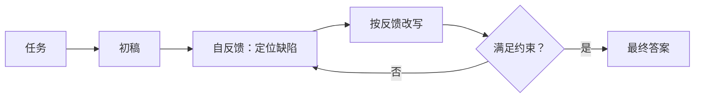
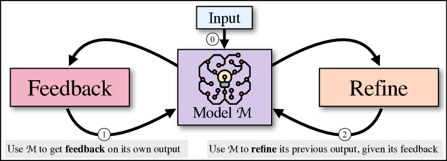

# Self-Refine：用模型自己的反馈迭代答案

> Self-Refine 在不更新参数的情况下循环执行“生成—自反馈—改写”，把推理时计算用于
> 发现并修正当前答案的问题。

## 论文信息

| 字段 | 内容 |
|---|---|
| 论文链接 | [Self-Refine: Iterative Refinement with Self-Feedback](https://arxiv.org/abs/2303.17651) |
| 公司 / 机构 | Carnegie Mellon University / Allen Institute for AI / University of Washington / NVIDIA / UC San Diego / Google Research |
| 首次公开日期 | 2023-03-30 |
| 原作者代码 | [已开源：madaan/self-refine](https://github.com/madaan/self-refine) |
| 本地 adapter / CLI key | `self-refine` |
| 本地复现代码 | `src/auto_research/agent_research/` |

## 原始论文总结

### 背景与主要改动

一次生成很难同时满足所有约束。Self-Refine 让同一个 LLM 先生成初稿，再针对任务维度
给出可执行反馈，最后据此改写；若反馈判断已满足要求则停止，不需要额外训练数据、
人工反馈或外部 reward model。



<!-- paper-figure:start -->
### 原论文关键图

[](https://ar5iv.labs.arxiv.org/html/2303.17651/assets/x1.png)

> **原论文 Figure 1（关键图）**：展示原论文方法的总体设计和关键组成。图片来自[原论文](https://arxiv.org/abs/2303.17651)，版权归原作者所有；点击图片可查看来源。
<!-- paper-figure:end -->

### 核心公式

$$
y_0=M_{\mathrm{gen}}(x),\qquad
f_t=M_{\mathrm{feedback}}(x,y_t),\qquad
y_{t+1}=M_{\mathrm{refine}}(x,y_t,f_t).
$$

### 论文离线与线上效果

论文在七类任务上报告相对一次生成最高约 40 个百分点的绝对提升，并有人类偏好评测；
没有生产线上 A/B 实验。

## 本地复现

PlanBench mini 固定 120 episodes：joint success 1.0000、平均成本 2.0000，
执行 120 次反馈和 120 次 refinement，共记录 240 个 reasoning steps。

```bash
auto-research agent-eval --method self-refine \
  --benchmark planbench-mini --episodes 120 --seed 42
```

稳定指标：
[`classic-agent-mini-suites-seed42.json`](../../experiments/classic-agent-mini-suites-seed42.json)。

## 复现边界

实现显式初稿、约束反馈、修订和停止链路；mini-suite 用确定性 critic 验证状态迁移，
没有调用论文中的通用 LLM，也不能用 1.0 成功率替代七项原始 benchmark 结果。
