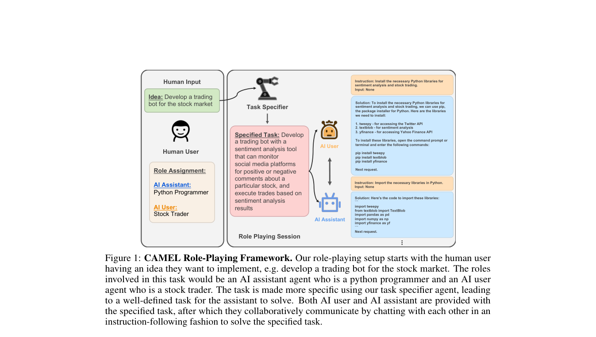

# CAMEL

> **保真度：核心机制复现**。本页不把确定性 mini-suite 冒充原论文完整 benchmark。

## 论文信息

| 字段 | 内容 |
|---|---|
| 论文链接 | [CAMEL（arXiv 2303.17760）](https://arxiv.org/abs/2303.17760) |
| 公司 / 机构 | Guohao Li（按一作归档） |
| 首次公开日期 | 2023-03-31（arXiv v1） |
| 原作者代码 | 是：[原作者仓库](https://github.com/camel-ai/camel) |
| 本地 adapter / 方法键 | `camel` |
| 本地复现代码 | [`src/auto_research/agent_research/`](https://github.com/daiwk/auto-research/tree/main/src/auto_research/agent_research/) |

## 原始论文总结

### 背景与主要改动

用 inception prompting 固定 user/assistant 的角色、目标和边界，通过轮流消息完成任务并生成可研究的多 Agent 社会轨迹。


<!-- paper-figure:start -->
### 原论文关键图

[](https://arxiv.org/pdf/2303.17760#page=4)

> **原论文 Figure 1（关键图）**：展示原论文提出的核心架构、主要模块及其连接关系。图片来自[原论文](https://arxiv.org/abs/2303.17760)，版权归原作者所有；点击图片可查看来源。
<!-- paper-figure:end -->

### 核心公式

$$
m_t^A\sim\pi_A(\cdot|r_A,g,h_t),\quad m_t^B\sim\pi_B(\cdot|r_B,g,h_t,m_t^A).
$$

### 论文离线与线上效果

NeurIPS 2023 系统研究多 Agent instruction-following cooperation；无生产 A/B。 论文未报告生产线上 A/B，本页不补造线上数字。

## 本地复现

planbench-mini、120 episodes、seed 42：joint success **1.0000**，average cost **1.3500**。

```bash
auto-research agent-study --method camel --benchmark planbench-mini --episodes 120 --seed 42
auto-research evolve --model agent --dataset planbench-mini --direction "组合 camel 与已安装论文算子" --generations 2 --population 4
```

固定指标见 [`../../experiments/global-p1-20260808-seed42.json`](../../experiments/global-p1-20260808-seed42.json)。

## 复现边界

本地只验证论文特有目标、状态更新或评测协议；没有复刻原论文大模型、多卡训练、私有环境或完整公开 benchmark，因而只报告机制验证。
