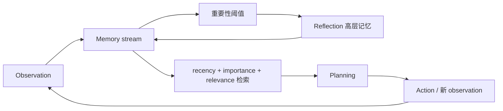

# Generative Agents：记忆、反思与计划

> 本页实现 memory stream 的相关性/近期性/重要性检索、累计重要性触发反思，以及
> 用检索记忆生成计划。

## 论文信息

| 字段 | 内容 |
|---|---|
| 论文链接 | [Generative Agents: Interactive Simulacra of Human Behavior](https://arxiv.org/abs/2304.03442) |
| 公司 / 机构 | Stanford University / Google Research |
| 首次公开日期 | 2023-04-07 |
| 原作者代码 | [已开源](https://github.com/joonspk-research/generative_agents) |
| 本地 adapter / CLI key | `generative-agents` |
| 本地复现代码 | `src/auto_research/agent_research/` |

## 原始论文总结

### 背景与主要改动

只把完整历史塞给 LLM 无法支撑长期一致行为。论文把每次观察写入 memory stream，
按 recency、importance、relevance 检索；累计重要事件达到阈值后生成更高层 reflection，
再结合记忆与当前状态制定日程和行动计划。



### 核心公式

$$
s(m,q)=\alpha\,\mathrm{recency}(m)
+\beta\,\mathrm{importance}(m)
+\gamma\,\mathrm{relevance}(m,q).
$$

### 论文离线与线上效果

论文在 25-agent Smallville 中展示邀请传播、关系形成和协同行为；人类评估与消融
表明 observation、planning、reflection 都影响行为可信度。没有生产线上 A/B 实验。

## 本地复现

EvoMem mini 120 episodes、seed 42、memory size 24，采用三项打分取 top-3，并按累计
重要性合成 reflection。

| 指标 | Long-context 基线 | Generative Agents |
|---|---:|---:|
| joint success | 1.0000 | 1.0000 |
| average cost | 64.5000 | **1.7900** |
| retrieved memories / reflections | 0 / 0 | 354 / 30 |

```bash
auto-research agent-eval --method generative-agents --benchmark evomem-mini \
  --episodes 120 --memory-size 24 --seed 42
```

稳定指标：
[`p0-missing-agent-mini-suites-seed42.json`](../../experiments/p0-missing-agent-mini-suites-seed42.json)。

## 复现边界

复现记忆打分、反思触发和计划依赖；没有运行 25 个 LLM persona、Smallville 地图或
人类可信度评测，因此这里只比较执行成功率、上下文代理成本和内部状态。
