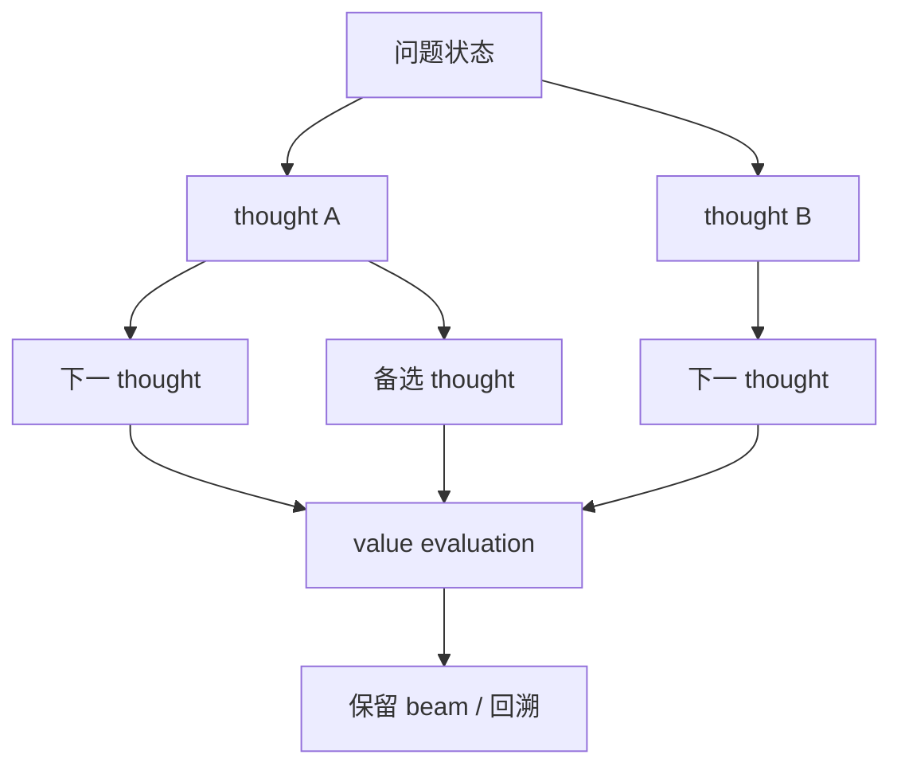

# Tree of Thoughts

> 本页实现 thought 单元的分支扩展、BFS beam 选择、value evaluation 与回溯，不是
> 单条 Chain-of-Thought。

## 论文信息

| 字段 | 内容 |
|---|---|
| 论文链接 | [Tree of Thoughts: Deliberate Problem Solving with Large Language Models](https://arxiv.org/abs/2305.10601) |
| 公司 / 机构 | Princeton University / Google DeepMind |
| 首次公开日期 | 2023-05-17 |
| 原作者代码 | [已开源](https://github.com/princeton-nlp/tree-of-thought-llm) |
| 本地 adapter / CLI key | `tree-of-thoughts` |
| 本地复现代码 | `src/auto_research/agent_research/` |

## 原始论文总结

### 背景与主要改动

自回归生成和单条 CoT 很难撤销早期错误。ToT 将中间推理视为可独立评价的 thought，
在树上生成多个候选，使用语言模型 value 函数选择 BFS/DFS frontier，并允许
lookahead 和 backtracking。



### 核心公式

$$
S_{t+1}=\operatorname{TopK}_{s'\in\operatorname{Expand}(S_t)}
V_\theta(s'),\qquad
y^*=\arg\max_{y\in\mathcal T}V_\theta(y).
$$

### 论文离线与线上效果

Game of 24 上 GPT-4 CoT 成功率为 4%，ToT 达到 74%；论文还在 Creative
Writing 和 Mini Crosswords 验证搜索能力。没有生产线上 A/B 实验。

## 本地复现

PlanBench mini 上逐层扩展正确/干扰 action thought，以 workflow coherence
为 value，beam width 2。

| 指标 | Tree of Thoughts |
|---|---:|
| joint success | **1.0000** |
| average cost | 2.5000 |
| expanded nodes / backtracks | 1200 / 480 |

```bash
auto-research agent-eval --method tree-of-thoughts \
  --benchmark planbench-mini --episodes 120 --seed 42
```

稳定指标：
[`classic-agent-mini-suites-seed42.json`](../../experiments/classic-agent-mini-suites-seed42.json)。

## 复现边界

实现 thought tree、BFS、value pruning 和回溯；value 是确定性 workflow coherence，
未调用 GPT-4 自评，也未运行 Game of 24，因此 1.0 只验证搜索机制。
