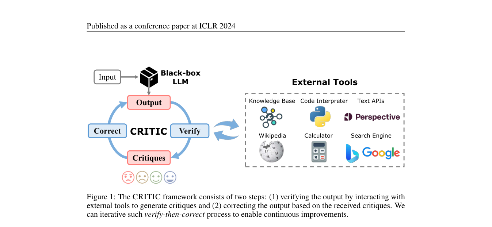

# CRITIC

> 让 Agent 用外部工具验证初稿，再依据真实反馈自我修正。

## 论文信息

| 字段 | 内容 |
|---|---|
| 论文链接 | [CRITIC: Large Language Models Can Self-Correct with Tool-Interactive Critiquing](https://arxiv.org/abs/2305.11738) |
| 公司 / 机构 | Microsoft / Tsinghua University |
| 首次公开日期 | 2023-05-19 |
| 原作者代码 | [已开源](https://github.com/microsoft/ProphetNet/tree/master/CRITIC) |
| 本地 adapter / method key | `critic` |
| 本地复现代码 | `src/auto_research/agent_research/` |

## 原始论文总结

### 背景与主要改动

仅让 LLM 反思自己的文本可能重复同一错误。CRITIC 调用搜索、代码解释器等外部工具，
把可观测反馈带回修订循环，使 critique 有环境证据。


<!-- paper-figure:start -->
### 原论文关键图

[](https://arxiv.org/pdf/2305.11738#page=2)

> **原论文 Figure 1（关键图）**：展示原论文提出的核心架构、主要模块及其连接关系。图片来自[原论文](https://arxiv.org/abs/2305.11738)，版权归原作者所有；点击图片可查看来源。
<!-- paper-figure:end -->

### 核心公式

$$
y^{(t+1)}=\operatorname{Revise}\!\left(
x,y^{(t)},\operatorname{Tool}(y^{(t)})\right).
$$

### 论文离线与线上效果

论文在开放问答、数学程序合成和毒性降低任务上报告一致改进，强调外部反馈相对纯
self-correction 的作用；没有生产线上 A/B 实验。

## 本地复现

Agent 先写入一个有缺陷 patch，真实运行 unittest 获取 traceback，再根据反馈写入正确
patch 并复测；报告记录每轮编辑、命令、退出码和输出。

```bash
auto-research agent-eval --method critic --benchmark swebench-local \
  --episodes 12 --seed 42
```

稳定指标：
[`agent-code-sandbox-seed42.json`](../../experiments/agent-code-sandbox-seed42.json)。

## 复现边界

外部反馈和迭代改码是真实执行的；反馈源仅为受控代码测试，没有搜索引擎、toxicity
classifier 或通用 LLM critic。
