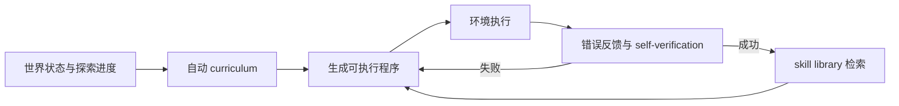
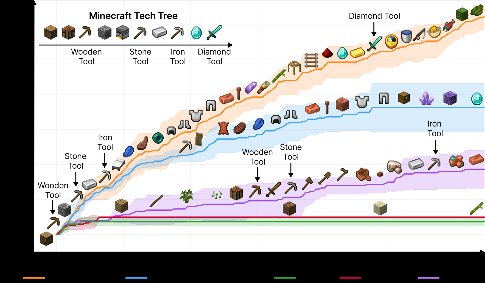

# Voyager

> 本页实现自动课程入口、执行反馈/自验证，以及可增长、可复用的 executable
> skill library；不声称在本地复刻 Minecraft 世界。

## 论文信息

| 字段 | 内容 |
|---|---|
| 论文链接 | [Voyager: An Open-Ended Embodied Agent with Large Language Models](https://arxiv.org/abs/2305.16291) |
| 公司 / 机构 | NVIDIA / Caltech / UT Austin / Stanford / ASU |
| 首次公开日期 | 2023-05-25 |
| 原作者代码 | [已开源](https://github.com/MineDojo/Voyager) |
| 本地 adapter / CLI key | `voyager` |
| 本地复现代码 | `src/auto_research/agent_research/` |

## 原始论文总结

### 背景与主要改动

开放世界 Agent 需要持续选择有新颖性的任务、把成功行为积累为技能，并根据环境
报错修复程序。Voyager 用 GPT-4 自动生成 curriculum，以代码作为动作空间；成功
程序按描述索引进 skill library，新任务检索并组合已有技能。



<!-- paper-figure:start -->
### 原论文关键图

[](https://ar5iv.labs.arxiv.org/html/2305.16291/assets/figures/main_experiment_fig.png)

> **原论文 Figure 1（关键图）**：展示原论文方法的总体设计和关键组成。图片来自[原论文](https://arxiv.org/abs/2305.16291)，版权归原作者所有；点击图片可查看来源。
<!-- paper-figure:end -->

### 核心公式

$$
g_t=\operatorname{Curriculum}(s_t,\mathcal S_t),\quad
z_t=\operatorname{Generate}(g_t,s_t,\operatorname{Retrieve}(\mathcal S_t,g_t)),
\quad
\mathcal S_{t+1}=\mathcal S_t\cup\{z_t\}\ \text{if Verify}(z_t)=1.
$$

### 论文离线与线上效果

论文在 Minecraft 获得 3.3 倍独特物品、2.3 倍探索距离，关键科技树里程碑最高
快 15.3 倍；新世界中技能库还能迁移到未见任务。没有生产线上 A/B 实验。

## 本地复现

PlanBench mini 固定 120 episodes。新任务族触发生成/执行/自验证，成功后写入
技能库；相同 procedure 后续直接检索复用。

| 指标 | Voyager |
|---|---:|
| joint success | **1.0000** |
| average cost | 1.1200 |
| skills created / reused | 12 / 108 |
| verification retries | 12 |

```bash
auto-research agent-eval --method voyager --benchmark planbench-mini \
  --episodes 120 --memory-size 24 --seed 42
```

稳定指标：
[`classic-agent-mini-suites-seed42.json`](../../experiments/classic-agent-mini-suites-seed42.json)。

## 复现边界

保留 curriculum/skill/verification 三组件和跨 episode 复用；本地技能是结构化工具
计划，不是 Mineflayer JavaScript，未运行 Minecraft、GPT-4 与 embedding retrieval。
