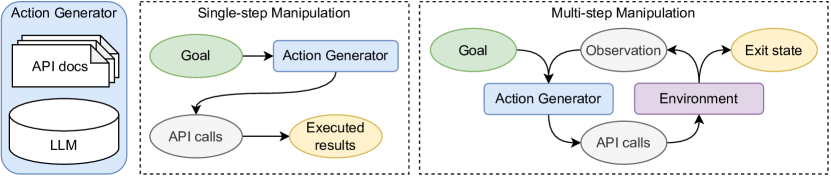

# ToolBench / ToolLLM

> **保真度：核心机制复现**。本页不把确定性 mini-suite 冒充原论文完整 benchmark。

## 论文信息

| 字段 | 内容 |
|---|---|
| 论文链接 | [ToolBench / ToolLLM（arXiv 2305.16504）](https://arxiv.org/abs/2305.16504) |
| 公司 / 机构 | Tsinghua University |
| 首次公开日期 | 2023-05-25（arXiv v1） |
| 原作者代码 | 否：未发现/未发布该论文原作者官方代码仓库 |
| 本地 adapter / 方法键 | `toolbench` |
| 本地复现代码 | [`src/auto_research/agent_research/`](https://github.com/daiwk/auto-research/tree/main/src/auto_research/agent_research/) |

## 原始论文总结

### 背景与主要改动

分析开源 LLM 工具失败后，组合程序化使用样例、system prompt、in-context demonstration retriever 与生成格式约束。


<!-- paper-figure:start -->
### 原论文关键图

[](https://ar5iv.labs.arxiv.org/html/2305.16504/assets/x1.png)

> **原论文 Figure 1（关键图）**：展示原论文方法的总体设计和关键组成。图片来自[原论文](https://arxiv.org/abs/2305.16504)，版权归原作者所有；点击图片可查看来源。
<!-- paper-figure:end -->

### 核心公式

$$
a^*=\arg\max_a p_\theta(a|x,D_{tool},p_{sys}),\quad R=\mathbf1[\operatorname{execute}(a)=y].
$$

### 论文离线与线上效果

最高 90% tool success；8 个 ToolBench 任务中 4 个可与 GPT-4 竞争。 论文未报告生产线上 A/B，本页不补造线上数字。

## 本地复现

planbench-mini、120 episodes、seed 42：joint success **1.0000**，average cost **0.8400**。

```bash
auto-research agent-study --method toolbench --benchmark planbench-mini --episodes 120 --seed 42
auto-research evolve --model agent --dataset planbench-mini --direction "组合 toolbench 与已安装论文算子" --generations 2 --population 4
```

固定指标见 [`../../experiments/global-p1-20260808-seed42.json`](../../experiments/global-p1-20260808-seed42.json)。

## 复现边界

本地只验证论文特有目标、状态更新或评测协议；没有复刻原论文大模型、多卡训练、私有环境或完整公开 benchmark，因而只报告机制验证。
