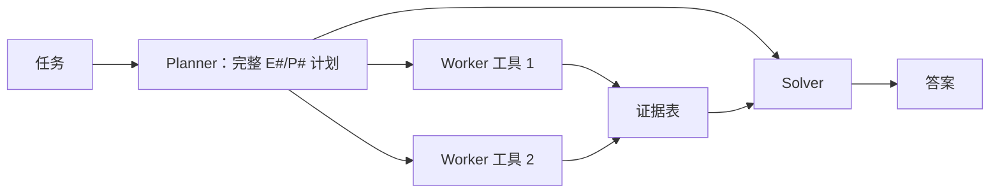

# ReWOO：把推理计划与工具观察解耦

> ReWOO 先一次性生成带依赖的完整计划，再由 Worker 执行工具，最后由 Solver 汇总；
> 避免 ReAct 每一步都把不断增长的 observation 送回 Planner。

## 论文信息

| 字段 | 内容 |
|---|---|
| 论文链接 | [ReWOO: Decoupling Reasoning from Observations for Efficient Augmented Language Models](https://arxiv.org/abs/2305.18323) |
| 公司 / 机构 | Microsoft Research / North Carolina State University / Texas A&M University |
| 首次公开日期 | 2023-05-29 |
| 原作者代码 | [已开源：billxbf/ReWOO](https://github.com/billxbf/ReWOO) |
| 本地 adapter / CLI key | `rewoo` |
| 本地复现代码 | `src/auto_research/agent_research/` |

## 原始论文总结

### 背景与主要改动

ReAct 在每次工具返回后重新调用 LLM，token 和推理成本随轨迹增长。ReWOO 的 Planner
用变量引用写出完整多步计划，Worker 只负责填入工具证据，Solver 最后读取计划与证据
生成答案，因此 Planner 不被中间观察反复打断。



### 核心公式

$$
P=\{(E_i,T_i,a_i(E_{<i}))\}_{i=1}^{n},\qquad
e_i=T_i(a_i(e_{<i})),\qquad y=S(x,P,e_{1:n}).
$$

### 论文离线与线上效果

论文报告约 5 倍 token efficiency，并在 HotpotQA 上相对基线提升约 4 个百分点，还展示
将 Planner 从 175B 模型卸载到 7B 模型的可行性；没有生产线上 A/B 实验。

## 本地复现

PlanBench mini 固定 120 episodes：joint success 1.0000、平均成本 3.5000，
生成 120 份完整计划并执行 360 次 worker/tool action。

```bash
auto-research agent-eval --method rewoo \
  --benchmark planbench-mini --episodes 120 --seed 42
```

稳定指标：
[`classic-agent-mini-suites-seed42.json`](../../experiments/classic-agent-mini-suites-seed42.json)。

## 复现边界

实现 Planner/Worker/Solver 解耦、显式依赖与证据汇总；本地没有真实搜索 API 和多尺寸
LLM，因此只验证控制流与调用计数，不复刻 HotpotQA 的语言生成分数。
