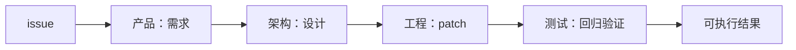
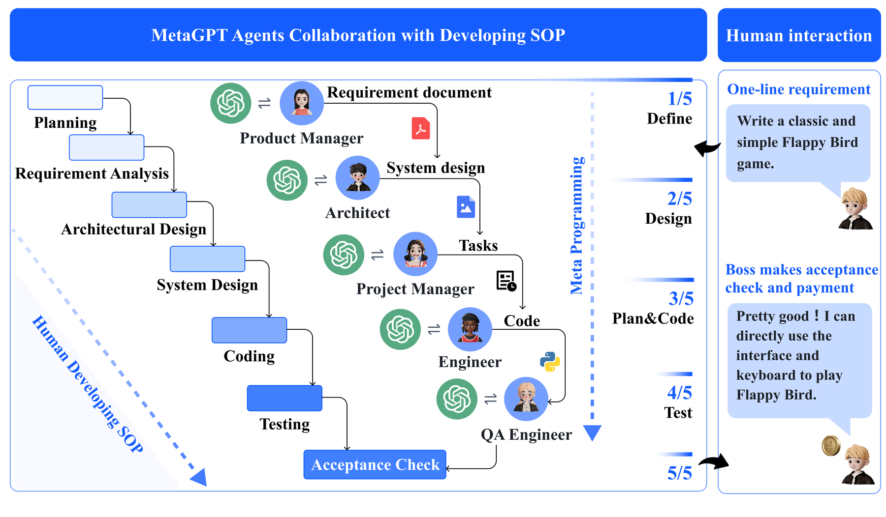

# MetaGPT

> 用标准作业流程（SOP）把软件需求依次交给产品、架构、工程和测试角色。

## 论文信息

| 字段 | 内容 |
|---|---|
| 论文链接 | [MetaGPT: Meta Programming for A Multi-Agent Collaborative Framework](https://arxiv.org/abs/2308.00352) |
| 公司 / 机构 | DeepWisdom / Xiamen University / KAUST 等 |
| 首次公开日期 | 2023-08-01 |
| 原作者代码 | [已开源](https://github.com/FoundationAgents/MetaGPT) |
| 本地 adapter / method key | `metagpt` |
| 本地复现代码 | `src/auto_research/agent_research/` |

## 原始论文总结

### 背景与主要改动

简单串联多个聊天 Agent 容易让幻觉级联。MetaGPT 把人类软件团队的 SOP 编码成
角色化消息流程，每个角色生产结构化中间物，由下游角色消费和验证。



<!-- paper-figure:start -->
### 原论文关键图

[](https://ar5iv.labs.arxiv.org/html/2308.00352/assets/imgs/1-metagpt_overall_update.png)

> **原论文 Figure 1（关键图）**：展示原论文方法的总体设计和关键组成。图片来自[原论文](https://arxiv.org/abs/2308.00352)，版权归原作者所有；点击图片可查看来源。
<!-- paper-figure:end -->

### 核心公式

其核心是工作流而非单一 loss。本地将过程写成有序状态转移：

$$
s_{t+1}=f_{r_t}(s_t,a_t),\qquad
r_t\in\{\mathrm{PM,Architect,Engineer,QA}\}.
$$

### 论文离线与线上效果

论文在 HumanEval 与 MBPP 等协作式软件工程任务上报告比聊天式多 Agent 更连贯、
可执行的结果；没有生产线上 A/B 实验。

## 本地复现

每个 episode 创建真实临时 Python 仓库；四个角色留下结构化 artifact，工程角色修改
文件，QA 角色通过固定 `python -m unittest -q` 执行回归测试。

```bash
auto-research agent-eval --method metagpt --benchmark swebench-local \
  --episodes 12 --seed 42
```

稳定指标：
[`agent-code-sandbox-seed42.json`](../../experiments/agent-code-sandbox-seed42.json)。

## 复现边界

保留 SOP、角色交付物、真实编辑与测试；本地不是完整 MetaGPT LLM 对话，也不是官方
SWE-bench Lite，fixture 仅验证执行链路和可审计 trace。
