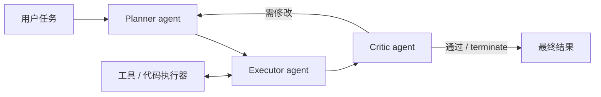

# AutoGen：可编程的多 Agent 对话

> AutoGen 把 Agent 抽象为可对话、可配置的角色，用消息路由和终止条件编排
> planner、executor、critic、人类或工具。

## 论文信息

| 字段 | 内容 |
|---|---|
| 论文链接 | [AutoGen: Enabling Next-Gen LLM Applications via Multi-Agent Conversation](https://arxiv.org/abs/2308.08155) |
| 公司 / 机构 | Microsoft Research |
| 首次公开日期 | 2023-08-16 |
| 原作者代码 | [已开源：microsoft/autogen](https://github.com/microsoft/autogen) |
| 本地 adapter / CLI key | `autogen` |
| 本地复现代码 | `src/auto_research/agent_research/` |

## 原始论文总结

### 背景与主要改动

复杂应用常需要多个模型、工具和人类协作，手写控制流难复用。AutoGen 提供
ConversableAgent 与 conversation programming：每个角色声明能力、回复策略和终止条件，
通过群聊或嵌套会话组合成工作流。



### 核心公式

AutoGen 主要是编排抽象而非新损失函数，可写为消息驱动状态机：

$$
m_{t+1}=A_{r_t}(H_t,\mathcal T_{r_t}),\qquad
H_{t+1}=H_t\cup\{(r_t,m_{t+1})\},\qquad
\text{stop}(H_{t+1})\in\{0,1\}.
$$

### 论文离线与线上效果

论文通过数学、代码生成、问答和决策类应用展示多 Agent 对话相对单 Agent 的能力与
开发效率改善；这些是应用评测和案例，没有生产线上 A/B 实验。

## 本地复现

PlanBench mini 固定 120 episodes：joint success 1.0000、平均成本 3.0000，
记录 120 份 plan、360 条跨角色消息和 120 次 critic round。

```bash
auto-research agent-eval --method autogen \
  --benchmark planbench-mini --episodes 120 --seed 42
```

稳定指标：
[`classic-agent-mini-suites-seed42.json`](../../experiments/classic-agent-mini-suites-seed42.json)。

## 复现边界

实现 planner/executor/critic 的消息协议、角色交接与显式终止；未嵌入完整 AutoGen
运行时、容器代码执行或真实 LLM 群聊，1.0 是确定性控制流测试而非论文应用得分。
