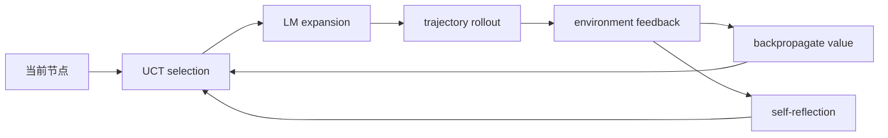
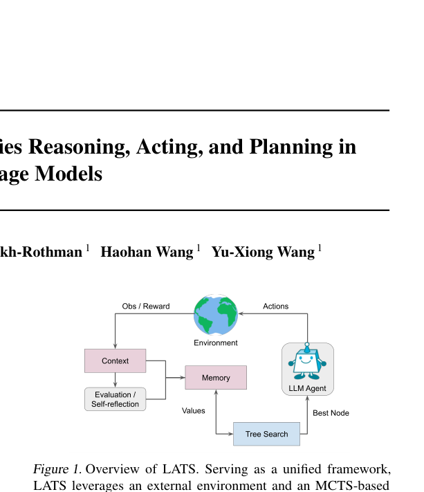

# LATS：Language Agent Tree Search

> 本页实现 UCT 式树搜索、完整 trajectory rollout、环境 reward、反思与回溯。

## 论文信息

| 字段 | 内容 |
|---|---|
| 论文链接 | [Language Agent Tree Search Unifies Reasoning Acting and Planning in Language Models](https://arxiv.org/abs/2310.04406) |
| 公司 / 机构 | University of Illinois Urbana-Champaign |
| 首次公开日期 | 2023-10-06 |
| 原作者代码 | [已开源](https://github.com/lapisrocks/LanguageAgentTreeSearch) |
| 本地 adapter / CLI key | `lats` |
| 本地复现代码 | `src/auto_research/agent_research/` |

## 原始论文总结

### 背景与主要改动

ReAct 等方法通常沿单条轨迹行动，失败后缺少系统搜索。LATS 把 LM 同时作为 agent、
value function 和 optimizer，嵌入 Monte Carlo Tree Search；环境执行提供外部
reward，失败轨迹生成 reflection，帮助后续搜索避开错误。



<!-- paper-figure:start -->
### 原论文关键图

[](https://arxiv.org/pdf/2310.04406#page=1)

> **原论文 Figure 1（关键图）**：展示原论文提出的核心架构、主要模块及其连接关系。图片来自[原论文](https://arxiv.org/abs/2310.04406)，版权归原作者所有；点击图片可查看来源。
<!-- paper-figure:end -->

### 核心公式

$$
\operatorname{UCT}(s,a)=Q(s,a)+c\sqrt{\frac{\log N(s)}{N(s,a)}},
\qquad
Q(s,a)\leftarrow Q(s,a)+\frac{r-Q(s,a)}{N(s,a)}.
$$

### 论文离线与线上效果

论文最新版报告 GPT-4 在 HumanEval 达到 92.7% pass@1；GPT-3.5 在 WebShop
平均分 75.9。论文覆盖编程、交互 QA、网页导航和数学，没有生产线上 A/B 实验。

## 本地复现

每个 PlanBench episode 搜索四条完整计划轨迹；环境返回 exact plan reward，失败
轨迹产生 reflection/backtrack，再按累计 value 选最终路径。

| 指标 | LATS |
|---|---:|
| joint success | **1.0000** |
| average cost | 4.0000 |
| rollouts / reflections / backtracks | 480 / 360 / 360 |

```bash
auto-research agent-eval --method lats \
  --benchmark planbench-mini --episodes 120 --seed 42
```

稳定指标：
[`classic-agent-mini-suites-seed42.json`](../../experiments/classic-agent-mini-suites-seed42.json)。

## 复现边界

保留 MCTS statistics、环境反馈、reflection 与回溯；本地树以完整计划为叶节点，未
调用 LM value model、HumanEval executor 或 WebShop，搜索规模远小于论文。
