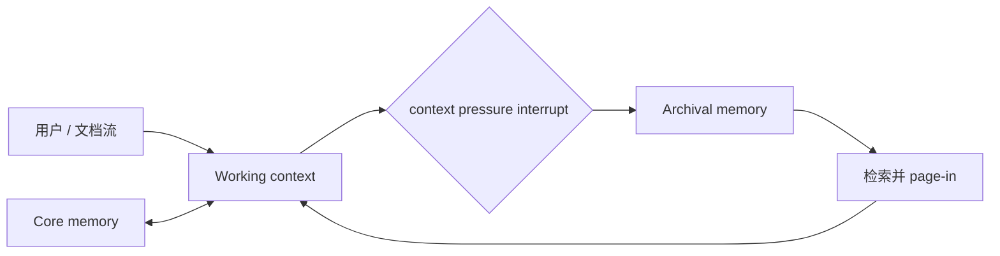
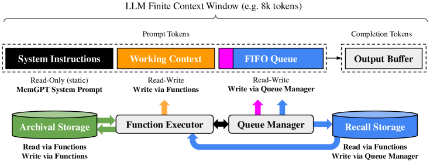

# MemGPT：面向有限上下文的虚拟内存

> 本页实现 core、working、archival 三层状态，工作上下文超预算时触发 interrupt、
> page-out，并在后续任务中 page-in。

## 论文信息

| 字段 | 内容 |
|---|---|
| 论文链接 | [MemGPT: Towards LLMs as Operating Systems](https://arxiv.org/abs/2310.08560) |
| 公司 / 机构 | University of California, Berkeley |
| 首次公开日期 | 2023-10-12 |
| 原作者代码 | [已开源；现为 Letta](https://github.com/letta-ai/letta) |
| 本地 adapter / CLI key | `memgpt` |
| 本地复现代码 | `src/auto_research/agent_research/` |

## 原始论文总结

### 背景与主要改动

有限 context window 使长文档和多轮会话不断遗忘。MemGPT 借鉴操作系统虚拟内存，
把常驻核心信息、当前工作上下文和外部归档分层管理；模型通过函数调用移动数据，并以
interrupt/heartbeat 控制继续推理和与用户交互。



<!-- paper-figure:start -->
### 原论文关键图

[](https://ar5iv.labs.arxiv.org/html/2310.08560/assets/x3.png)

> **原论文 Figure 3（关键图）**：展示原论文方法的总体设计和关键组成。图片来自[原论文](https://arxiv.org/abs/2310.08560)，版权归原作者所有；点击图片可查看来源。
<!-- paper-figure:end -->

### 核心公式

$$
\text{if }|W_t|>B:\quad
A_{t+1}=A_t\cup\operatorname{pageout}(W_t),\qquad
W_{t+1}\leftarrow\operatorname{pagein}(q,A_{t+1}).
$$

### 论文离线与线上效果

论文在超出底层模型 context window 的文档分析和多 session 对话上对比固定上下文
与检索基线，展示持续记忆和动态反思能力。没有生产线上 A/B 实验。

## 本地复现

EvoMem mini 120 episodes、seed 42、memory size 24；working tier 使用一半容量，压力
触发 page-out，重复任务从 archival tier page-in。

| 指标 | Long-context 基线 | MemGPT |
|---|---:|---:|
| joint success | 1.0000 | 1.0000 |
| average cost | 64.5000 | **0.9200** |
| archival writes / page-ins / interrupts | 0 / 0 / 0 | 108 / 96 / 108 |

```bash
auto-research agent-eval --method memgpt --benchmark evomem-mini \
  --episodes 120 --memory-size 24 --seed 42
```

稳定指标：
[`p0-missing-agent-mini-suites-seed42.json`](../../experiments/p0-missing-agent-mini-suites-seed42.json)。

## 复现边界

实现分层状态、换入换出和 interrupt 计数；归档检索使用确定性 key，不调用 embedding
服务或 LLM function calling。成本是统一代理成本，不是 token 或线上延迟。
