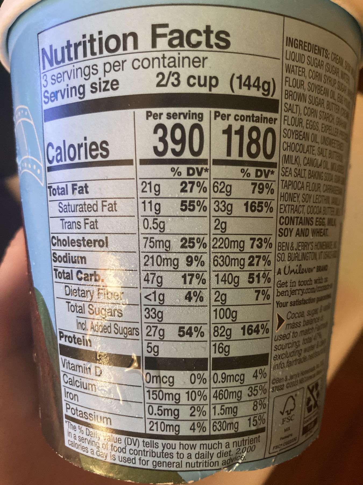

# GAIA

> **保真度：核心机制复现**。本页不把确定性 mini-suite 冒充原论文完整 benchmark。

## 论文信息

| 字段 | 内容 |
|---|---|
| 论文链接 | [GAIA（arXiv 2311.12983）](https://arxiv.org/abs/2311.12983) |
| 公司 / 机构 | Grégoire Mialon（按一作归档） |
| 首次公开日期 | 2023-11-21（arXiv v1） |
| 原作者代码 | 是：[官方 benchmark](https://huggingface.co/gaia-benchmark) |
| 本地 adapter / 方法键 | `gaia` |
| 本地复现代码 | [`src/auto_research/agent_research/`](https://github.com/daiwk/auto-research/tree/main/src/auto_research/agent_research/) |

## 原始论文总结

### 背景与主要改动

以 466 个真实问题联合考查推理、多模态、网页浏览与工具使用，采用精确短答案和三级难度。


<!-- paper-figure:start -->
### 原论文关键图

[](https://ar5iv.labs.arxiv.org/html/2311.12983/assets/figures/ice_cream.jpg)

> **原论文 Figure 1（关键图）**：展示原论文的训练流程与关键优化环节。图片来自[原论文](https://arxiv.org/abs/2311.12983)，版权归原作者所有；点击图片可查看来源。
<!-- paper-figure:end -->

### 核心公式

$$
\operatorname{score}=N^{-1}\sum_i\mathbf1[\operatorname{normalize}(\hat y_i)=\operatorname{normalize}(y_i)].
$$

### 论文离线与线上效果

人类 92%，带插件 GPT-4 15%；300 个答案保留用于 leaderboard。 论文未报告生产线上 A/B，本页不补造线上数字。

## 本地复现

gaia-mini、120 episodes、seed 42：joint success **1.0000**，average cost **1.4000**。

```bash
auto-research agent-study --method gaia --benchmark gaia-mini --episodes 120 --seed 42
auto-research evolve --model agent --dataset gaia-mini --direction "组合 gaia 与已安装论文算子" --generations 2 --population 4
```

固定指标见 [`../../experiments/global-p1-20260808-seed42.json`](../../experiments/global-p1-20260808-seed42.json)。

## 复现边界

本地只验证论文特有目标、状态更新或评测协议；没有复刻原论文大模型、多卡训练、私有环境或完整公开 benchmark，因而只报告机制验证。
