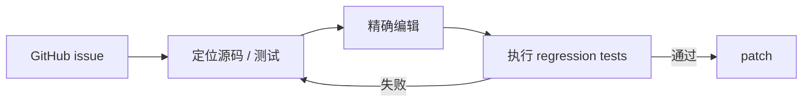

# SWE-agent

> 为软件工程 Agent 设计面向仓库浏览、编辑和测试的 Agent-Computer Interface。

## 论文信息

| 字段 | 内容 |
|---|---|
| 论文链接 | [SWE-agent: Agent-Computer Interfaces Enable Automated Software Engineering](https://arxiv.org/abs/2405.15793) |
| 公司 / 机构 | Princeton University |
| 首次公开日期 | 2024-05-06 |
| 原作者代码 | [已开源](https://github.com/SWE-agent/SWE-agent) |
| 本地 adapter / method key | `swe-agent` |
| 本地复现代码 | `src/auto_research/agent_research/` |

## 原始论文总结

### 背景与主要改动

通用 shell 对 LLM 而言动作空间过宽、输出冗长。SWE-agent 用专门 ACI 约束仓库搜索、
文件查看、精确编辑和测试，让模型能围绕 issue 定位故障并验证 patch。



### 核心公式

$$
a_t\sim\pi(\cdot|o_{\le t},I),\qquad
o_{t+1}=\operatorname{ACI}(R_t,a_t).
$$

### 论文离线与线上效果

论文在 SWE-bench 上验证 ACI 对自动修复真实 GitHub issue 的提升；这是离线软件工程
benchmark，不是生产线上 A/B。

## 本地复现

本地 ACI 只暴露读文件、写 `solution.py` 和固定 unittest 命令；每题初始仓库必须先
真实失败，Agent 定位、编辑并以退出码验证。

```bash
auto-research agent-eval --method swe-agent --benchmark swebench-local \
  --episodes 12 --seed 42
```

稳定指标：
[`agent-code-sandbox-seed42.json`](../../experiments/agent-code-sandbox-seed42.json)。

## 复现边界

这是可执行的 SWE-style micro benchmark，不是官方 SWE-bench Lite 数据与 Docker
镜像。名称 `swebench-local` 明确保留该区别，不能将本地 success 当作论文 resolved rate。
