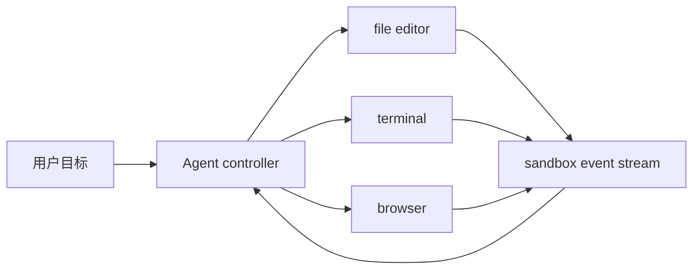

# OpenHands

> 用编辑器、终端和可观测事件流驱动通用软件开发 Agent。

## 论文信息

| 字段 | 内容 |
|---|---|
| 论文链接 | [OpenHands: An Open Platform for AI Software Developers as Generalist Agents](https://arxiv.org/abs/2407.16741) |
| 公司 / 机构 | All-Hands-AI / Carnegie Mellon University 等 |
| 首次公开日期 | 2024-07-23 |
| 原作者代码 | [已开源](https://github.com/All-Hands-AI/OpenHands) |
| 本地 adapter / method key | `openhands` |
| 本地复现代码 | `src/auto_research/agent_research/` |

## 原始论文总结

### 背景与主要改动

OpenHands 提供开放的软件 Agent 平台，把终端、编辑器、浏览器等动作统一到 event
stream，并以 sandbox 隔离执行，覆盖修 bug、写代码和仓库维护。



### 核心公式

$$
e_{t+1}=\operatorname{Sandbox}(a_t),\qquad
a_{t+1}=\pi(g,e_{\le t+1}).
$$

### 论文离线与线上效果

论文以 SWE-bench 等软件工程评测展示开放平台和多种 Agent controller 的能力；
没有生产线上 A/B 实验。

## 本地复现

本地将 file-editor 与 terminal 动作写入 event stream；terminal 在独立临时目录执行
固定回归测试，最终报告动作、编辑 hash、命令输出和 success。

```bash
auto-research agent-eval --method openhands --benchmark swebench-local \
  --episodes 12 --seed 42
```

稳定指标：
[`agent-code-sandbox-seed42.json`](../../experiments/agent-code-sandbox-seed42.json)。

## 复现边界

已实现编辑器/终端事件和真实代码 sandbox；浏览器动作目前只保留接口语义，尚未连接
网页交互环境，也未运行完整 OpenHands controller 与官方 SWE-bench 容器。
