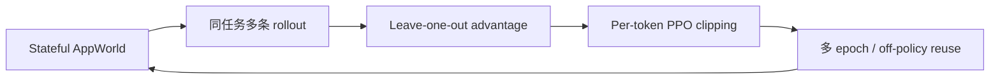
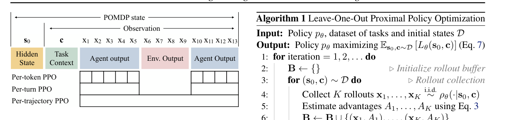

# LOOP：面向长程交互 Agent 的无 value-network PPO

> 保真度：实现多轨迹采样、leave-one-out advantage、离策略样本复用和逐 token
> trust-region clipping 诊断；当前是确定性交互 mini-suite，不是 AppWorld 32B 训练。

## 论文信息

| 字段 | 内容 |
|---|---|
| 论文链接 | [Reinforcement Learning for Long-Horizon Interactive LLM Agents](https://arxiv.org/abs/2502.01600) |
| 公司 / 机构 | Apple |
| 首次公开日期 | 2025-02-03 |
| 原作者代码 | 是：[apple/ml-loop](https://github.com/apple/ml-loop) |
| 本地 adapter / method key | `loop` |
| 本地复现代码 | [`src/auto_research/agent_research/`](https://github.com/daiwk/auto-research/tree/main/src/auto_research/agent_research) |

## 原始论文总结

### 背景与主要改动

长程数字 Agent 的 rollout 昂贵，而传统 PPO 还要维护 value model。LOOP 把 PPO
trust region 与 leave-one-out baseline 结合：无需 critic，可对同一批轨迹进行多次
更新；逐 token importance ratio 只裁剪漂移 token，不丢弃整条长轨迹。



<!-- paper-figure:start -->
### 原论文关键图

[](https://arxiv.org/abs/2502.01600)

> **原论文 Figure 2**：交互 POMDP 中 per-token、per-turn 与 per-trajectory PPO 的区别。
> 图片来自[原论文](https://arxiv.org/abs/2502.01600)，版权归原作者所有。
<!-- paper-figure:end -->

### 核心公式

$$
A_k=R_k-\frac1{K-1}\sum_{i\ne k}R_i,\qquad
L=\frac1{|x|}\sum_t\min(\rho_tA_k,\operatorname{clip}(\rho_t)A_k).
$$

### 论文离线与线上效果

论文在 AppWorld 上用 32B 模型超过更大的 OpenAI o1 `9` 个百分点（相对 `15%`），
并观察到更少臆测、更多 API 文档查询与失败恢复；没有生产线上 A/B。

## 本地复现

```bash
auto-research agent-eval --method loop \
  --benchmark planbench-mini --episodes 120 --seed 42
```

| 指标 | 本地结果 |
|---|---:|
| joint success | 1.0000 |
| average cost | 2.2000 |
| off-policy reuse | 476 |
| leave-one-out updates / per-token clips | 480 / 120 |

稳定指标见
[`omitted-agentic-rl-opd-seed42.json`](../../experiments/omitted-agentic-rl-opd-seed42.json)。

## 复现边界

本地真实执行多轨迹选择和统计更新，但没有 AppWorld、32B LLM 或梯度 checkpoint；
mini-suite 满分只说明轨迹控制逻辑正确，不代表论文任务难度。
