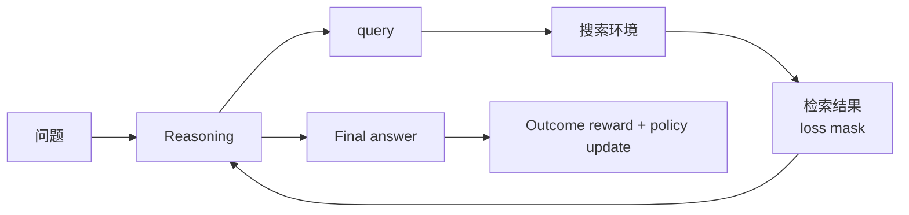
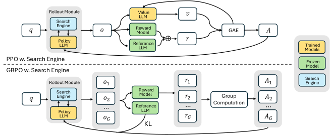

# Search-R1：通过强化学习训练推理与搜索交错的 Agent

> 保真度：本地实现多轮推理/搜索状态转换、检索 token loss mask 和 outcome reward；
> 使用确定性 ScaleMCP mini，不调用论文的 E5 索引或训练 Qwen。

## 论文信息

| 字段 | 内容 |
|---|---|
| 论文链接 | [Search-R1: Training LLMs to Reason and Leverage Search Engines with Reinforcement Learning](https://arxiv.org/abs/2503.09516) |
| 公司 / 机构 | UIUC / UMass Amherst / Google Cloud AI Research |
| 首次公开日期 | 2025-03-12 |
| 原作者代码 | [PeterGriffinJin/Search-R1](https://github.com/PeterGriffinJin/Search-R1) |
| 本地 adapter / method key | `search-r1` |
| 本地复现代码 | [`src/auto_research/agent_research/`](https://github.com/daiwk/auto-research/tree/main/src/auto_research/agent_research) |

## 原始论文总结

### 背景与主要改动

普通 RAG 一次检索后再回答，无法让策略根据中间证据继续调整查询。Search-R1 把搜索
引擎视为环境：模型可在 reasoning 中多次输出搜索动作，环境返回文档后继续推理。
训练只对模型生成 token 计算 PPO/GRPO loss，检索结果 token 必须 mask，最终答案用
简单 outcome reward 评分。



<!-- paper-figure:start -->
### 原论文关键图

[](https://arxiv.org/html/2503.09516/x1.png)

> **原论文 Figure 1**：展示 PPO/GRPO rollout 中模型与搜索引擎的多轮交互。
> 图片来自[原论文](https://arxiv.org/abs/2503.09516)，版权归原作者所有。
<!-- paper-figure:end -->

### 核心公式

$$
\max_{\pi_\theta}\;
\mathbb E_{x,y\sim\pi_\theta(\cdot|x;\mathcal R)}[r(x,y)]
-\beta D_{\mathrm{KL}}
\left(\pi_\theta(\cdot|x;\mathcal R)\Vert\pi_{\mathrm{ref}}(\cdot|x;\mathcal R)\right),
$$

其中检索环境返回的 token 不属于策略动作，因此其 loss mask 为 0。

### 论文离线与线上效果

论文在七个 QA 数据集上报告：Qwen2.5-7B、Qwen2.5-3B 和 Llama3.2-3B 相对同设置
RAG 基线分别提升约 26%、21% 和 10%；没有生产线上 A/B。

## 本地复现

```bash
auto-research agent-eval --method search-r1 \
  --benchmark scalemcp-mini --episodes 120 --seed 42
```

| 指标 | Search-R1 |
|---|---:|
| joint success | 1.0000 |
| average cost | 2.7500 |
| search queries | 240 |
| masked retrieved tokens | 1800 |
| outcome policy updates | 120 |

稳定指标见
[`classic-agentic-rl-opd-seed42.json`](../../experiments/classic-agentic-rl-opd-seed42.json)。

## 复现边界

mini-suite 的检索结果是确定性的当前任务上下文，适合验证交错状态机和 loss mask；
没有真实网页索引、Qwen 参数更新或七个 QA benchmark，因此成功率不能与论文 EM 比较。
