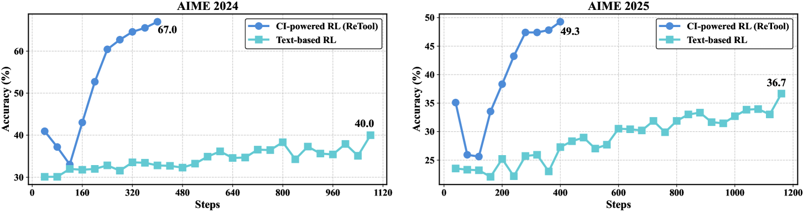

# ReTool：在推理链中学习何时调用工具

> **保真度：核心机制复现**。本页不把确定性 mini-suite 冒充原论文完整 benchmark。

## 论文信息

| 字段 | 内容 |
|---|---|
| 论文链接 | [ReTool：在推理链中学习何时调用工具（arXiv 2504.11536）](https://arxiv.org/abs/2504.11536) |
| 公司 / 机构 | ByteDance Seed |
| 首次公开日期 | 2025-04-15（arXiv v1） |
| 原作者代码 | 未发现/未发布原作者官方代码仓库 |
| 本地 adapter / 方法键 | `retool` |
| 本地复现代码 | [`src/auto_research/agent_research/`](https://github.com/daiwk/auto-research/tree/main/src/auto_research/agent_research/) |

## 原始论文总结

### 背景与主要改动

策略在自然语言 reasoning 与工具执行之间交替，并由可执行反馈学习调用、纠错和停止。


<!-- paper-figure:start -->
### 原论文关键图

[](https://ar5iv.labs.arxiv.org/html/2504.11536/assets/x1.png)

> **原论文 Figure 1（关键图）**：展示原论文方法的总体设计和关键组成。图片来自[原论文](https://arxiv.org/abs/2504.11536)，版权归原作者所有；点击图片可查看来源。
<!-- paper-figure:end -->

### 核心公式

$$
\tau=(z_1,a_1,o_1,\ldots),\quad R=R_{answer}-c\sum_t\mathbf1[a_t=tool],\quad\max_\pi\mathbb E[R].
$$

### 论文离线与线上效果

论文在数学推理和工具增强任务上超过无工具与固定调用基线。 论文未报告生产线上 A/B，本页不补造线上数字。

## 本地复现

PlanBench mini-suite、120 episodes、seed 42：joint success **1.0000**，average cost 1.0500；方法特有操作有非零 telemetry。

```bash
auto-research agent-eval --method retool --benchmark planbench-mini --episodes 120 --seed 42
auto-research evolve --model agent --dataset planbench-mini --direction "组合 retool 与已安装论文算子" --generations 2 --population 4
```

固定指标见 [`../../experiments/global-p0-20260808-seed42.json`](../../experiments/global-p0-20260808-seed42.json)。

## 复现边界

本地只验证论文特有目标、状态更新和公平预算；没有复刻原论文的大模型、多卡 RL、私有环境、真实网页或完整 benchmark，因而只报告机制验证，不声称数值复现原表。
