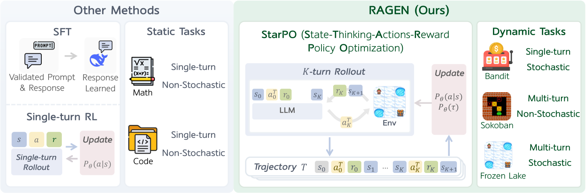

# RAGEN：稳定的多轮 Agent 强化学习

> 保真度：本地实现 StarPO-S 的 trajectory rollout、退化轨迹过滤、critic baseline、
> reasoning-aware reward、Echo Trap 探针和解耦 clipping 诊断。

## 论文信息

| 字段 | 内容 |
|---|---|
| 论文链接 | [RAGEN: Understanding Self-Evolution in LLM Agents via Multi-Turn Reinforcement Learning](https://arxiv.org/abs/2504.20073) |
| 公司 / 机构 | Northwestern / Stanford / Microsoft / UW / NYU / UBC / SMU |
| 首次公开日期 | 2025-04-24 |
| 原作者代码 | [RAGEN-AI/RAGEN](https://github.com/RAGEN-AI/RAGEN) |
| 本地 adapter / method key | `ragen` |
| 本地复现代码 | [`src/auto_research/agent_research/`](https://github.com/daiwk/auto-research/tree/main/src/auto_research/agent_research) |

## 原始论文总结

### 背景与主要改动

单轮数学 RL 的优化单位是一次回答，而 Agent 要在随机环境中跨多轮决策。RAGEN 提出
StarPO，把 state、thinking、action 和 reward 组织成完整轨迹。论文还观察到
Echo Trap：reward 方差突然塌缩并伴随梯度尖峰。StarPO-S 通过轨迹过滤、critic
baseline、梯度稳定和解耦 clipping 抑制这种自我强化的重复模式。


<!-- paper-figure:start -->
### 原论文关键图

[](https://arxiv.org/html/2504.20073v2/x1.png)

> **原论文 Figure 1**：对比单轮生成 RL 与支持随机环境多轮交互的 StarPO。
> 图片来自[原论文](https://arxiv.org/abs/2504.20073)，版权归原作者所有。
<!-- paper-figure:end -->

### 核心公式

$$
J_{\mathrm{StarPO}}(\theta)
=\mathbb E_{\tau\sim\pi_{\theta_{\mathrm{old}}}}
\left[
\min\left(r_\theta(\tau)A(\tau),
\operatorname{clip}(r_\theta(\tau),1-\epsilon_-,1+\epsilon_+)A(\tau)\right)
\right].
$$

StarPO-S 进一步在轨迹进入该目标前执行不确定性/质量过滤，并对 critic 与梯度单独稳定。

### 论文离线与线上效果

论文在 Bandit、Sokoban、FrozenLake 和 WebShop 等环境系统分析训练稳定性，报告
StarPO-S 可缓解 Echo Trap，并在符号环境与 WebShop 上显著优于未训练策略；论文同时
指出部分任务中 SFT 仍优于 RL。没有生产线上 A/B。

## 本地复现

```bash
auto-research agent-eval --method ragen \
  --benchmark planbench-mini --episodes 120 --seed 42
```

| 指标 | RAGEN / StarPO-S |
|---|---:|
| joint success | 1.0000 |
| average cost | 1.6000 |
| trajectory rollouts / filtered | 480 / 120 |
| critic baseline updates | 120 |
| Echo Trap probes / gradient clips | 19 / 19 |

稳定指标见
[`classic-agentic-rl-opd-seed42.json`](../../experiments/classic-agentic-rl-opd-seed42.json)。

## 复现边界

本地策略在确定性候选轨迹上选择计划，真实执行但不更新 LLM 参数；Echo Trap 是固定
频率的可观测稳定性探针，不冒充论文训练曲线。未运行 WebShop 或原始游戏环境。
