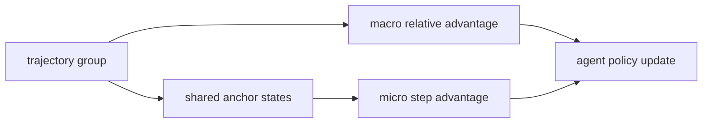
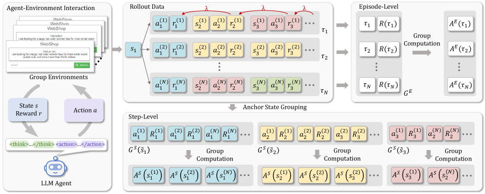

# GiGPO：Agent 的组中组相对优势

> 本页在公开候选策略或确定性 Agent mini-suite 上复现可隔离的 RL 更新机制；不把轻量实验写成原论文规模模型或 benchmark 结论。

## 论文信息

| 字段 | 内容 |
|---|---|
| 论文链接 | [GiGPO：Agent 的组中组相对优势（arXiv 2505.10978）](https://arxiv.org/abs/2505.10978) |
| 公司 / 机构 | Nanyang Technological University / Skywork AI |
| 首次公开日期 | 2025-05-16 |
| 原作者代码 | 未发现官方代码 |
| 本地 adapter / 算法键 | `gigpo` |
| 本地复现代码 | [`src/auto_research/agent_research/`](https://github.com/daiwk/auto-research/tree/main/src/auto_research/agent_research/) |

## 原始论文总结

### 背景与主要改动

多轮 Agent 的最终奖励稀疏，整条轨迹的 group relative advantage 无法判断哪个 environment step 做对了。GiGPO 先在完整轨迹组上计算 macro advantage，再按跨轨迹重复到达的 anchor state 建立 step group，计算 micro relative advantage。



<!-- paper-figure:start -->
### 原论文关键图

[](https://ar5iv.labs.arxiv.org/html/2505.10978/assets/x2.png)

> **原论文 Figure 2（关键图）**：展示原论文方法的总体设计和关键组成。图片来自[原论文](https://arxiv.org/abs/2505.10978)，版权归原作者所有；点击图片可查看来源。
<!-- paper-figure:end -->

### 核心公式

$$
A^{\rm GiGPO}_{t}=A^{\rm macro}(\tau)+A^{\rm micro}(s_t,a_t),\quad A^{\rm micro}=r(s_t,a_t)-\operatorname{mean}_{a\in\mathcal G(s_t)}r(s_t,a).
$$

### 论文离线与线上效果

论文在 ALFWorld、WebShop 与 search-augmented QA 上报告相对 GRPO 的显著提升，ALFWorld 超过 12%、WebShop 超过 9%；未报告线上 A/B。

## 本地复现

在 PlanBench mini 中显式生成完整轨迹组与 step group，分别统计组间和组内优势、trajectory rollout 与 turn credit。

```bash
auto-research agent-eval --method gigpo --benchmark planbench-mini --episodes 120 --seed 42
```

固定 seed 汇总指标见 [`rl-papers-summary-seed42.json`](../../experiments/rl-papers-summary-seed42.json)。

## 复现边界

确定性任务没有跨轨迹真实环境 state 合流，使用共享计划步骤作为可审计 anchor-state 代理。
