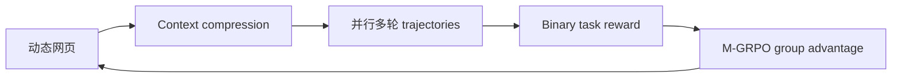
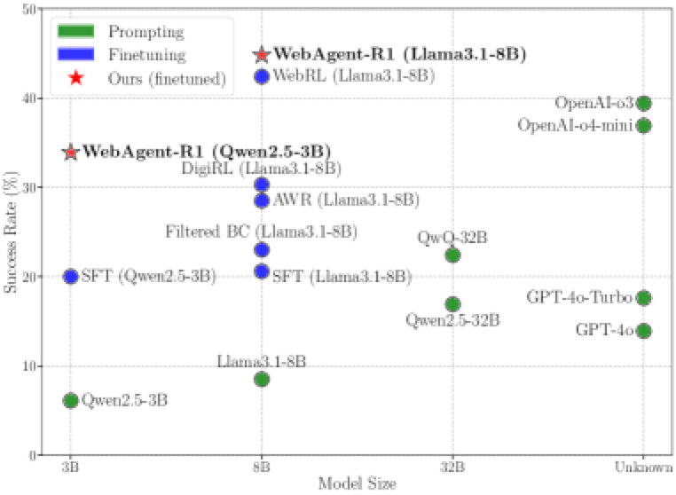

# WebAgent-R1：端到端多轮网页 Agent 强化学习

> 保真度：实现动态上下文压缩、并行完整轨迹、binary outcome reward 和多轮
> group-relative update；当前使用确定性工具 mini-suite，不冒充 WebArena-Lite。

## 论文信息

| 字段 | 内容 |
|---|---|
| 论文链接 | [WebAgent-R1: Training Web Agents via End-to-End Multi-Turn Reinforcement Learning](https://arxiv.org/abs/2505.16421) |
| 公司 / 机构 | University of Virginia / Amazon / Georgia Tech |
| 首次公开日期 | 2025-05-22 |
| 原作者代码 | 是：[weizhepei/WebAgent-R1](https://github.com/weizhepei/WebAgent-R1) |
| 本地 adapter / method key | `webagent-r1` |
| 本地复现代码 | [`src/auto_research/agent_research/`](https://github.com/daiwk/auto-research/tree/main/src/auto_research/agent_research) |

## 原始论文总结

### 背景与主要改动

网页交互会不断累积 HTML 和历史动作，单轮 GRPO 无法处理状态变化。WebAgent-R1
动态保留近期和任务相关上下文，并行采集完整多轮轨迹，再用 M-GRPO 根据最终成功
奖励执行组内相对更新；论文同时强调行为克隆 warm-up 和长 CoT 初始化。



<!-- paper-figure:start -->
### 原论文关键图

[](https://arxiv.org/html/2505.16421v2/x1.png)

> **原论文 Figure 1**：WebAgent-R1 与网页 Agent 基线在 WebArena-Lite 上的对比。
> 图片来自[原论文](https://arxiv.org/abs/2505.16421)，版权归原作者所有。
<!-- paper-figure:end -->

### 核心公式

$$
\hat A_i=\frac{R_i-\operatorname{mean}(R_{1:G})}
{\operatorname{std}(R_{1:G})+\epsilon},\qquad
L_{\mathrm{M\text{-}GRPO}}=\mathbb E_{i,t}
\min(\rho_{i,t}\hat A_i,\operatorname{clip}(\rho_{i,t})\hat A_i).
$$

### 论文离线与线上效果

WebArena-Lite 上，Qwen2.5-3B 成功率从 `6.1%` 提升到 `33.9%`，Llama3.1-8B
从 `8.5%` 提升到 `44.8%`；没有生产线上 A/B。

## 本地复现

```bash
auto-research agent-eval --method webagent-r1 \
  --benchmark scalemcp-mini --episodes 120 --seed 42
```

| 指标 | 本地结果 |
|---|---:|
| joint success | 1.0000 |
| average cost | 2.6000 |
| compressed context tokens | 360 |
| parallel groups / M-GRPO updates | 120 / 120 |

稳定指标见
[`omitted-agentic-rl-opd-seed42.json`](../../experiments/omitted-agentic-rl-opd-seed42.json)。

## 复现边界

本地环境返回确定性文本工具观测，没有浏览器 DOM、网页副作用或 Qwen/Llama 参数更新。
因此只验证多轮 rollout、压缩和组内奖励路径。
