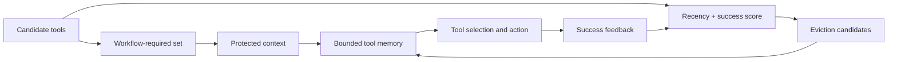

# MemTool：有限上下文中的动态工具记忆

> 保真度：本地实现 hybrid 工具记忆、工作流保护和动态淘汰；ScaleMCP mini 只验证
> 多轮工具集合管理，不包含 5,000 个真实 MCP server。

## 论文信息

| 字段 | 内容 |
|---|---|
| 论文链接 | [MemTool（arXiv 2507.21428）](https://arxiv.org/abs/2507.21428) |
| 公司 / 机构 | PricewaterhouseCoopers Commercial Technology and Innovation Office |
| 首次公开日期 | 2025-07-29 |
| 原作者代码 | 截至 2026-07-27 未在论文页发现公开仓库 |
| 本地 adapter / 方法键 | `memtool` |
| 本地复现代码 | [`src/auto_research/agent_research/`](https://github.com/daiwk/auto-research/tree/main/src/auto_research/agent_research) |

## 原始论文总结

### 背景与主要改动

大量 MCP 工具描述会迅速占满上下文，静态截断又可能删掉当前工作流需要的工具。
MemTool 比较 autonomous、workflow 和 hybrid 管理方式；hybrid 策略保护当前工作流的
必需工具，其余工具依据近期性和历史成功率动态淘汰。



### 核心公式与算法

对非保护工具 $j$ 计算保留分数，并淘汰最低项：

$$
s_j=\lambda\,\mathrm{recency}_j
+(1-\lambda)\,\mathrm{success}_j,\qquad
j^\star=\arg\min_{j\notin\mathcal{T}_{\mathrm{required}}}s_j.
$$

工作流集合 $\mathcal{T}_{\mathrm{required}}$ 始终优先于启发式淘汰。

### 论文离线与线上效果

论文在 ScaleMCP 的 5,000 个 MCP servers 和连续 100 次交互上评测 13 个以上 LLM。
自主推理模型的工具移除率约为 90%–94%；workflow/hybrid 在上下文压缩上有效，
autonomous/hybrid 的任务完成最好。论文未报告生产线上 A/B。

## 本地复现

`scalemcp-mini` 生成连续工具需求，在固定 memory size 下更新保护集合、淘汰非必要
工具，并统计 task success、上下文成本和 `tool_evictions`。

```bash
auto-research agent-eval --method memtool \
  --benchmark scalemcp-mini --episodes 120 \
  --memory-size 8 --seed 42
```

| 指标 | MemTool |
|---|---:|
| joint success | 1.0000 |
| 平均成本 | 1.9812 |
| tool evictions | 200 |
| tool memory size | 8 |

稳定指标见
[`agent-mini-suites-seed42.json`](../../experiments/agent-mini-suites-seed42.json)。

## 复现边界

工具是本地确定性描述，没有真实 MCP 网络延迟、权限失败或模型工具选择误差。结果支持
受限上下文的淘汰逻辑与指标链路，不能直接对比论文的 5,000-server 实验。
