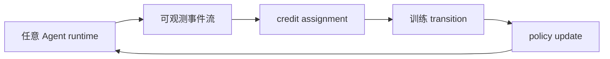
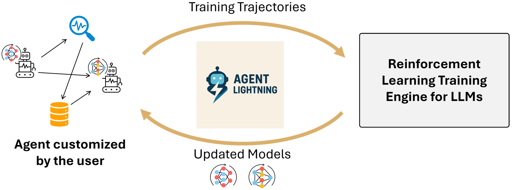

# Agent Lightning

> 解耦 Agent 执行与 RL 训练，并将长交互轨迹拆成可归因的训练 transition。

## 论文信息

| 字段 | 内容 |
|---|---|
| 论文链接 | [Agent Lightning: Train ANY AI Agents with Reinforcement Learning](https://arxiv.org/abs/2508.03680) |
| 公司 / 机构 | Microsoft Research |
| 首次公开日期 | 2025-08-05 |
| 原作者代码 | [已开源](https://github.com/microsoft/agent-lightning) |
| 本地 adapter / method key | `agent-lightning` |
| 本地复现代码 | `src/auto_research/agent_research/` |

## 原始论文总结

### 背景与主要改动

传统 Agent RL 常把所有上下文拼成单序列并与框架强耦合。Agent Lightning 将执行记录
成统一 MDP transition，以 credit assignment 拆解轨迹，并采用训练/执行分离架构。



<!-- paper-figure:start -->
### 原论文关键图

[](https://ar5iv.labs.arxiv.org/html/2508.03680/assets/figures/overview.png)

> **原论文 Figure 1（关键图）**：展示原论文提出的核心架构、主要模块及其连接关系。图片来自[原论文](https://arxiv.org/abs/2508.03680)，版权归原作者所有；点击图片可查看来源。
<!-- paper-figure:end -->

### 核心公式

$$
G_t=\sum_{k=t}^{T}\gamma^{k-t}r_k,\qquad
\nabla J(\theta)=\mathbb E[\nabla\log\pi_\theta(a_t|s_t)A_t].
$$

### 论文离线与线上效果

论文在 text-to-SQL、RAG 和数学工具使用任务上报告持续、稳定提升，并展示对不同
Agent 框架的低侵入接入；没有生产线上 A/B 实验。

## 本地复现

代码 Agent 的命令、编辑与测试形成 transition；测试退出码是真实 reward，失败时把
credit 归给 patch，并把正确修复按 bug family 写入可复用策略记忆。

```bash
auto-research agent-eval --method agent-lightning \
  --benchmark swebench-local --episodes 12 --memory-size 8 --seed 42
```

稳定指标：
[`agent-code-sandbox-seed42.json`](../../experiments/agent-code-sandbox-seed42.json)。

## 复现边界

实现了执行/训练解耦、transition、环境 reward、credit update 与跨 episode 复用；
本地更新的是受控 patch policy，不是对 LLM 参数执行 LightningRL。
