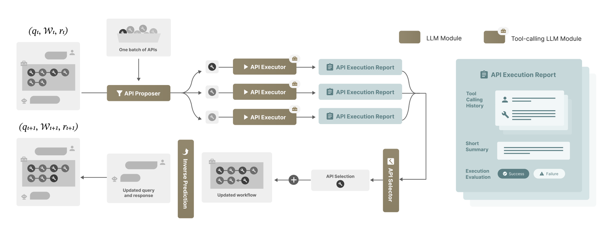

# ToolGrad: Efficient Tool-Use Dataset Generation with Textual Gradients

> **复现级别：L1 核心机制诊断。** 本地执行 answer-first 路线与去重 textual edit；未训练 12B 模型或运行 BFCL。

## 论文信息

| 字段 | 内容 |
|---|---|
| 论文链接 | [ToolGrad: Efficient Tool-Use Dataset Generation with Textual Gradients](https://arxiv.org/abs/2508.04086) |
| 公司/机构 | Google（按第一作者署名单位） |
| 首次公开日期 | 2025-08-06 |
| 原文开源代码 | 是：[https://github.com/zhongyi-zhou/toolgrad](https://github.com/zhongyi-zhou/toolgrad) |
| Adapter / 方法 | `toolgrad` |
| 本地复现代码 | [`src/auto_research/agent_research/latest_20260914.py`](https://github.com/daiwk/auto-research/blob/main/src/auto_research/agent_research/latest_20260914.py) |

## 原始论文总结

### 背景与主要改动

先从目标答案反推工具轨迹，再使用 textual gradient 定位并修订失败调用，降低人工轨迹标注成本。

<!-- paper-figure:start -->
### 原论文关键图

> **原论文 Figure 2（关键图）**：展示原论文提出的核心架构、主要模块及其连接关系。图片来自[原论文](https://arxiv.org/abs/2508.04086)，版权归原作者所有；点击图片可查看来源。
<!-- paper-figure:end -->

### 核心公式或操作

本地代码把论文决定性操作实现为确定性的 reference kernel，并显式输出门控、选择、投影、图边或状态更新统计；测试覆盖公式不变量和边界条件。

### 论文离线与线上效果

ToolGrad-12B 在 BFCL 达 83.1，接近 Gemini 2.5 Pro 的 83.2。 这些数字来自原论文，不与本地缩小实验直接比较；论文未报告线上 A/B 时不推断线上收益。

## 本地复现

三种子指标见 [`metrics/mechanism-seeds42-44.json`](metrics/mechanism-seeds42-44.json)。所有候选使用相同公开 fixture、预算和 seed；本页结果只证明核心状态转换实际执行。

### 复现边界

本地执行 answer-first 路线与去重 textual edit；未训练 12B 模型或运行 BFCL。
