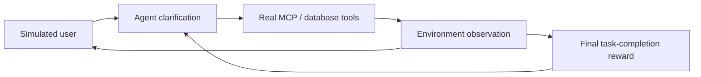
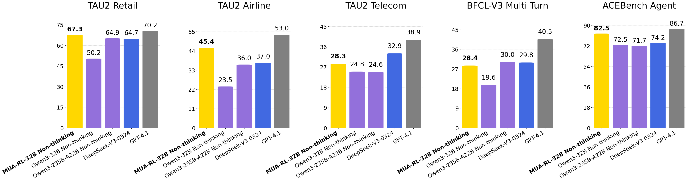

# MUA-RL：把动态用户纳入 Agent 工具强化学习

> 保真度：实现模拟用户多轮反馈、意图逐步澄清、真实工具观测、环境 token mask
> 语义和只基于最终完成度的奖励；当前为确定性工具 mini-suite。

## 论文信息

| 字段 | 内容 |
|---|---|
| 论文链接 | [MUA-RL: Multi-turn User-interacting Agent Reinforcement Learning for agentic tool use](https://arxiv.org/abs/2508.18669) |
| 公司 / 机构 | Meituan / Chinese Academy of Sciences / Peking University |
| 首次公开日期 | 2025-08-26 |
| 原作者代码 | 是：[zzwkk/MUA-RL](https://github.com/zzwkk/MUA-RL) |
| 本地 adapter / method key | `mua-rl` |
| 本地复现代码 | [`src/auto_research/agent_research/`](https://github.com/daiwk/auto-research/tree/main/src/auto_research/agent_research) |

## 原始论文总结

### 背景与主要改动

既有 tool-use RL 通常把用户请求视为固定输入，但真实用户会根据 Agent 回答不断修改
需求。MUA-RL 将 LLM 模拟用户直接放入 rollout，Agent 在对话中澄清意图并调用真实
MCP/数据库工具；用户消息和工具结果不计入策略 loss，只用最终任务完成奖励鼓励探索。



<!-- paper-figure:start -->
### 原论文关键图

[](https://arxiv.org/abs/2508.18669)

> **原论文 Figure 1**：MUA-RL 在多个多轮工具 benchmark 上的整体结果。
> 图片来自[原论文](https://arxiv.org/abs/2508.18669)，版权归原作者所有。
<!-- paper-figure:end -->

### 核心公式

$$
J(\theta)=\mathbb E_{\tau\sim\pi_\theta,\;u\sim\pi_{\mathrm{user}}}
\left[R_{\mathrm{task}}(\tau)\right],
$$

其中用户消息和工具响应属于环境 token，不参与策略 token loss。

### 论文离线与线上效果

MUA-RL-32B 在 TAU2 Retail/Airline/Telecom 分别达到 `67.3/45.4/28.3`，
BFCL-V3 Multi Turn 为 `28.4`，ACEBench Agent 为 `82.5`；没有生产线上 A/B。

## 本地复现

```bash
auto-research agent-eval --method mua-rl \
  --benchmark scalemcp-mini --episodes 120 --seed 42
```

| 指标 | 本地结果 |
|---|---:|
| joint success | 1.0000 |
| average cost | 2.2500 |
| simulated-user turns / intent refinements | 360 / 240 |
| tool responses / final rewards | 360 / 120 |

稳定指标见
[`omitted-agentic-rl-opd-seed42.json`](../../experiments/omitted-agentic-rl-opd-seed42.json)。

## 复现边界

本地模拟用户按任务上下文确定性揭示约束，工具实际返回 mini-suite 状态，但没有外部
LLM 用户或生产数据库。该实验验证交互与奖励边界，不复刻原模型规模。
