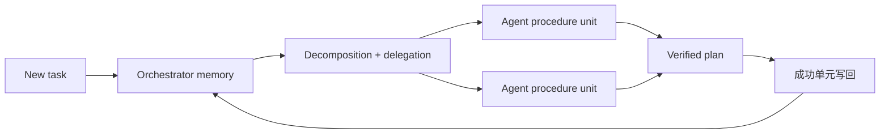
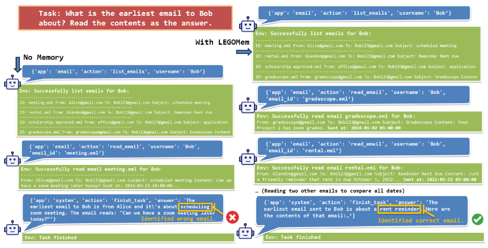

# LEGOMem：可组合的过程记忆

> 保真度：本地实现编排器与执行层过程单元、成功轨迹提取和跨 episode 复用；
> 当前 PlanBench mini 不替代论文的 OfficeBench 多 Agent 环境。

## 论文信息

| 字段 | 内容 |
|---|---|
| 论文链接 | [LEGOMem（arXiv 2510.04851）](https://arxiv.org/abs/2510.04851) |
| 公司 / 机构 | Microsoft Research |
| 首次公开日期 | 2025-10-06 |
| 原作者代码 | 截至 2026-07-27 未在论文页发现公开仓库 |
| 本地 adapter / 方法键 | `legomem` |
| 本地复现代码 | [`src/auto_research/agent_research/`](https://github.com/daiwk/auto-research/tree/main/src/auto_research/agent_research) |

## 原始论文总结

### 背景与主要改动

整段成功轨迹难以迁移到新任务，单一全局记忆又混合了任务分解和工具执行。LEGOMem
把经验拆成像积木一样的 procedural units：orchestrator memory 保存任务分解与委派，
agent memory 保存具体动作模板，运行时按新任务重新组合。



<!-- paper-figure:start -->
### 原论文关键图

[](https://ar5iv.labs.arxiv.org/html/2510.04851/assets/x5.png)

> **原论文 Figure 3（关键图）**：展示原论文方法的总体设计和关键组成。图片来自[原论文](https://arxiv.org/abs/2510.04851)，版权归原作者所有；点击图片可查看来源。
<!-- paper-figure:end -->

### 核心公式与算法

成功轨迹 $\tau$ 被拆成编排单元和执行单元，并按任务匹配后组合：

$$
\mathcal{M}=\mathcal{M}_{\mathrm{orch}}\cup\mathcal{M}_{\mathrm{agent}},
\qquad
\pi(T)=\operatorname{Compose}\!\left(
\operatorname{Retrieve}(T,\mathcal{M}_{\mathrm{orch}}),
\operatorname{Retrieve}(T,\mathcal{M}_{\mathrm{agent}})
\right).
$$

只有通过任务验证的过程单元才进入长期记忆。

### 论文离线与线上效果

论文在 OfficeBench 分析编排器记忆和 Agent 记忆的互补作用：前者主要改善分解与委派，
后者改善具体执行。论文没有生产线上 A/B；公开摘要未给出适合脱离表格引用的单一数值。

## 本地复现

`planbench-mini` 使用可验证结构化计划。实现从成功计划提取 action/domain 单元，
分别复用高层分解和细粒度动作，并记录 `reused_plans`。

```bash
auto-research agent-eval --method legomem \
  --benchmark planbench-mini --episodes 120 --seed 42
```

| 指标 | LEGOMem |
|---|---:|
| joint success | 1.0000 |
| 平均成本 | 1.1200 |
| reused plans | 108 |
| 最终 memory size | 12 |

稳定指标见
[`agent-mini-suites-seed42.json`](../../experiments/agent-mini-suites-seed42.json)。

## 复现边界

当前没有真实 Office 应用、LLM 多 Agent 委派或错误恢复。实现证明过程单元能提取、
验证和跨 episode 复用，但不构成 OfficeBench 原始结果的复刻。
