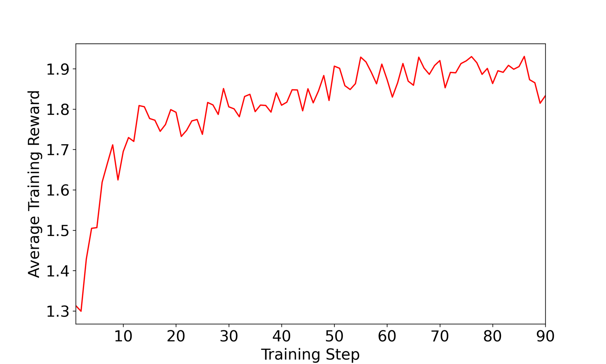

# SAGE：RL 驱动的自改进技能库

> **保真度：核心机制复现**。本页不把确定性 mini-suite 冒充原论文完整 benchmark。

## 论文信息

| 字段 | 内容 |
|---|---|
| 论文链接 | [SAGE：RL 驱动的自改进技能库（arXiv 2512.17102）](https://arxiv.org/abs/2512.17102) |
| 公司 / 机构 | Jiongxiao Wang 等（按一作归档） |
| 首次公开日期 | 2025-12-18（arXiv v1） |
| 原作者代码 | 未发现/未发布原作者官方代码仓库 |
| 本地 adapter / 方法键 | `sage` |
| 本地复现代码 | [`src/auto_research/agent_research/`](https://github.com/daiwk/auto-research/tree/main/src/auto_research/agent_research/) |

## 原始论文总结

### 背景与主要改动

从成功轨迹抽象技能，失败时修订或淘汰，并以任务回报学习技能检索与复用。


<!-- paper-figure:start -->
### 原论文关键图

[](https://arxiv.org/html/2512.17102v2/train.png)

> **原论文 Figure 5（关键图）**：展示原论文的训练流程与关键优化环节。图片来自[原论文](https://arxiv.org/abs/2512.17102)，版权归原作者所有；点击图片可查看来源。
<!-- paper-figure:end -->

### 核心公式

$$
s^*=\arg\max_{s\in\mathcal S}q_\phi(s|x),\quad\mathcal S\leftarrow\operatorname{Update}(\mathcal S,\tau,R),\quad\max_\phi\mathbb E[R].
$$

### 论文离线与线上效果

论文在连续任务上报告技能复用带来的成功率与样本效率提升。 论文未报告生产线上 A/B，本页不补造线上数字。

## 本地复现

PlanBench mini-suite、120 episodes、seed 42：joint success **1.0000**，average cost 0.3000；方法特有操作有非零 telemetry。

```bash
auto-research agent-eval --method sage --benchmark planbench-mini --episodes 120 --seed 42
auto-research evolve --model agent --dataset planbench-mini --direction "组合 sage 与已安装论文算子" --generations 2 --population 4
```

固定指标见 [`../../experiments/global-p0-20260808-seed42.json`](../../experiments/global-p0-20260808-seed42.json)。

## 复现边界

本地只验证论文特有目标、状态更新和公平预算；没有复刻原论文的大模型、多卡 RL、私有环境、真实网页或完整 benchmark，因而只报告机制验证，不声称数值复现原表。
