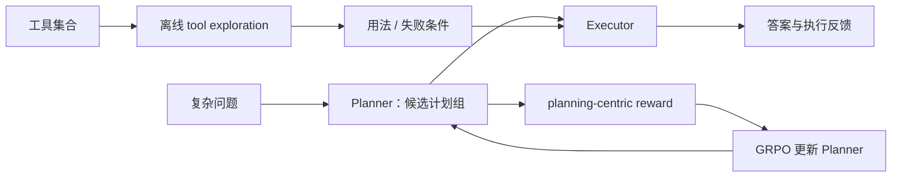
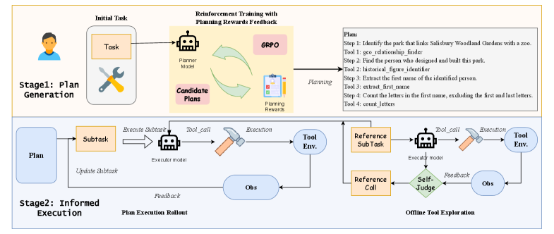

# PEARL：工具探索与规划强化学习

> PEARL 先离线探索工具的有效参数与失败条件，再用 planning-centric reward 和 GRPO
> 训练独立 Planner，把可靠执行与长程规划分开优化。

## 论文信息

| 字段 | 内容 |
|---|---|
| 论文链接 | [PEARL: Plan Exploration and Adaptive Reinforcement Learning for Multihop Tool Use](https://arxiv.org/abs/2601.20439) |
| 公司 / 机构 | 中国科学院信息工程研究所 / 中国科学院大学网络空间安全学院 |
| 首次公开日期 | 2026-01-28 |
| 原作者代码 | 未发现 / 未发布 |
| 本地 adapter / CLI key | `pearl` |
| 本地复现代码 | `src/auto_research/agent_research/` |

## 原始论文总结

### 背景与主要改动

多跳工具调用同时受工具幻觉、参数错误和长程规划薄弱影响。PEARL 的离线阶段用
trial-and-error 建立工具用法与失败条件；在线阶段把 Planner 与 Executor 解耦，用
计划正确性、工具链与最终结果组成的密集 reward 进行 GRPO，而不是只依赖稀疏成功信号。



<!-- paper-figure:start -->
### 原论文关键图

[](https://ar5iv.labs.arxiv.org/html/2601.20439/assets/x1.png)

> **原论文 Figure 1（关键图）**：展示原论文提出的核心架构、主要模块及其连接关系。图片来自[原论文](https://arxiv.org/abs/2601.20439)，版权归原作者所有；点击图片可查看来源。
<!-- paper-figure:end -->

### 核心公式

$$
P=((s_1,\tau_1),\ldots,(s_n,\tau_n)),\qquad
R_{\mathrm{plan}}=
w_1R_{\mathrm{tool}}+w_2R_{\mathrm{order}}+w_3R_{\mathrm{success}},
$$

$$
\hat A_i=\frac{R_i-\operatorname{mean}(R_{1:G})}
{\operatorname{std}(R_{1:G})+\epsilon},
\qquad
\mathcal J=\frac1G\sum_i\min(\rho_i\hat A_i,
\operatorname{clip}(\rho_i,1-\epsilon_c,1+\epsilon_c)\hat A_i).
$$

### 论文离线与线上效果

PEARL-7B 在 ToolHop 达到 56.5% success、3.8% invocation error，在 T-Eval 达到
77.0% success、1.0% error；去掉 planning reward 后 ToolHop success 降至 23.4%。
这些是公开 benchmark 离线实验，没有生产线上 A/B。

## 本地复现

PlanBench mini 固定 120 episodes：joint success 1.0000、平均成本 1.1200；
12 个新任务族进行 24 次计划探索和 12 次 policy update，随后复用计划 108 次。

```bash
auto-research agent-eval --method pearl \
  --benchmark planbench-mini --episodes 120 --memory-size 24 --seed 42
```

稳定指标：
[`classic-agent-mini-suites-seed42.json`](../../experiments/classic-agent-mini-suites-seed42.json)。

## 复现边界

实现离线候选计划探索、planning reward、组内选择更新、Planner/Executor 解耦和跨
episode 复用；未训练 Qwen2.5-7B，也未接入 ToolHop/T-Eval 的真实 API 与 GRPO 集群。
