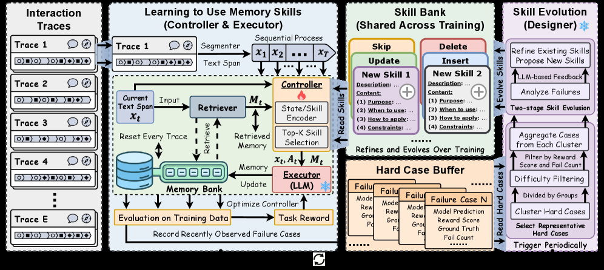

# MemSkill：把 episodic memory 固化成可执行技能

> **保真度：核心机制复现**。本页不把确定性 mini-suite 冒充原论文完整 benchmark。

## 论文信息

| 字段 | 内容 |
|---|---|
| 论文链接 | [MemSkill：把 episodic memory 固化成可执行技能（arXiv 2602.02474）](https://arxiv.org/abs/2602.02474) |
| 公司 / 机构 | Haozhen Zhang 等（按一作归档） |
| 首次公开日期 | 2026-02-02（arXiv v1） |
| 原作者代码 | [已开源](https://github.com/ViktorAxelsen/MemSkill) |
| 本地 adapter / 方法键 | `memskill` |
| 本地复现代码 | [`src/auto_research/agent_research/`](https://github.com/daiwk/auto-research/tree/main/src/auto_research/agent_research/) |

## 原始论文总结

### 背景与主要改动

controller 从历史 episode 选择记忆，designer 将重复成功模式编译为技能，并随新反馈升级技能版本。


<!-- paper-figure:start -->
### 原论文关键图

[](https://arxiv.org/html/2602.02474v2/x2.png)

> **原论文 Figure 2（关键图）**：展示原论文提出的核心架构、主要模块及其连接关系。图片来自[原论文](https://arxiv.org/abs/2602.02474)，版权归原作者所有；点击图片可查看来源。
<!-- paper-figure:end -->

### 核心公式

$$
m^*=q_\phi(x,M),\quad s=G(\tau,m^*),\quad M,S\leftarrow\operatorname{Consolidate}(M,S,R).
$$

### 论文离线与线上效果

论文在长程与跨任务 agent benchmark 上提升成功率并减少上下文开销。 论文未报告生产线上 A/B，本页不补造线上数字。

## 本地复现

PlanBench mini-suite、120 episodes、seed 42：joint success **1.0000**，average cost 0.3200；方法特有操作有非零 telemetry。

```bash
auto-research agent-eval --method memskill --benchmark planbench-mini --episodes 120 --seed 42
auto-research evolve --model agent --dataset planbench-mini --direction "组合 memskill 与已安装论文算子" --generations 2 --population 4
```

固定指标见 [`../../experiments/global-p0-20260808-seed42.json`](../../experiments/global-p0-20260808-seed42.json)。

## 复现边界

本地只验证论文特有目标、状态更新和公平预算；没有复刻原论文的大模型、多卡 RL、私有环境、真实网页或完整 benchmark，因而只报告机制验证，不声称数值复现原表。
