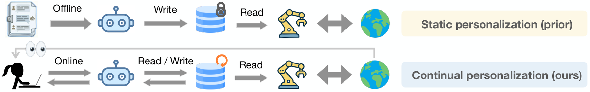

# Learning Personalized Agents from Human Feedback

> **复现级别：L1 核心机制诊断。** 本地执行显式记忆、澄清门和漂移覆盖，不读取隐藏 persona/gold action，不调用 GPT、机器人环境或论文购物模拟器。

## 论文信息

| 字段 | 内容 |
|---|---|
| 论文链接 | [arXiv](https://arxiv.org/abs/2602.16173) |
| 公司/机构 | Meta Superintelligence Labs / Princeton University（工作完成于 Meta）（按第一作者署名单位） |
| 首次公开日期 | 2026-02-18（arXiv v1） |
| 原文开源代码 | 是：[https://github.com/facebookresearch/PAHF](https://github.com/facebookresearch/PAHF) |
| Adapter | `pahf` |
| 本地复现代码 | [`src/auto_research/agent_research/official_meta_backfill_20261004.py`](https://github.com/daiwk/auto-research/tree/main/src/auto_research/agent_research/official_meta_backfill_20261004.py) |

## 原始论文总结

### 背景与主要改动

Agent 在行动前从显式用户记忆检索偏好，未知或低置信时主动澄清；行动后无论当前记忆是否自信，都接收纠正并覆盖过期偏好，从而处理新用户、上下文差异和偏好漂移。

<!-- paper-figure:start -->
### 原论文关键图

> **原论文 Figure 1（关键图）**：展示原论文提出的核心架构、主要模块及其连接关系。图片来自[原论文](https://arxiv.org/abs/2602.16173)，版权归原作者所有；点击图片可查看来源。
<!-- paper-figure:end -->

### 核心公式

$a_t=\pi_{act}(I_t,O_t,m_t,q_t,f_t^{pre})$；理论动态 regret 为 $O(K+\gamma Tm^{-k})$。

### 论文离线与线上效果

论文四阶段实验中 PAHF 在 embodied 的 Phase-2/4 为 70.5%/68.8%，shopping 为 41.3%/70.3%，均优于无记忆和单一反馈通道。

> 这些论文均未报告可归因于该方法的生产线上 A/B；上述数字是论文公开离线评测，不与本地诊断混写。

## 本地复现

- 三种子诊断：[`metrics/mechanism-seeds42-44.json`](metrics/mechanism-seeds42-44.json)
- 基线为机制关闭或默认状态；`diagnostic_only=true`，不进入正式能力排名。

## 复现边界

本地执行显式记忆、澄清门和漂移覆盖，不读取隐藏 persona/gold action，不调用 GPT、机器人环境或论文购物模拟器。
