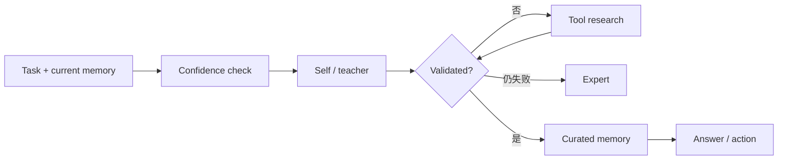

# U-Mem：自主知识获取与记忆管理

> 保真度：本地实现成本感知的分级获取、语义检索、Thompson sampling 和记忆验证；
> 当前 mini-suite 不包含论文使用的真实 LLM、HotpotQA 或 AIME 推理。

## 论文信息

| 字段 | 内容 |
|---|---|
| 论文链接 | [Towards Autonomous Memory Agents（arXiv 2602.22406）](https://arxiv.org/abs/2602.22406) |
| 公司 / 机构 | National University of Singapore |
| 首次公开日期 | 2026-02-25 |
| 原作者代码 | [匿名审稿仓库](https://anonymous.4open.science/r/code-release-456D/) |
| 本地 adapter / 方法键 | `u-mem` |
| 本地复现代码 | [`src/auto_research/agent_research/`](https://github.com/daiwk/auto-research/tree/main/src/auto_research/agent_research) |

## 原始论文总结

### 背景与主要改动

传统 Agent 记忆通常被动写入和检索，缺少“当前知识不够时主动去哪里找”的决策。
U-Mem 将获取过程建模为成本递增的级联：先尝试 self/teacher，再做工具研究，最后请求
expert；检索结合语义相似度与 Thompson sampling，并在写回前验证和整理记忆。



### 核心公式与算法

记忆项的选择同时考虑语义相关性与不确定性探索，可概括为：

$$
s(m\mid q)=\lambda\,\mathrm{sim}(q,m)
+(1-\lambda)\,\tilde p_m,\qquad
\tilde p_m\sim\mathrm{Beta}(\alpha_m,\beta_m).
$$

成功与失败反馈更新 Beta 后验；级联获取将额外知识收益与调用成本一起计入决策。

### 论文离线与线上效果

论文报告在 HotpotQA 上使用 Qwen2.5-7B 提升 14.6 points，在 AIME25 上使用
Gemini-2.5-Flash 提升 7.33 points。论文未报告生产线上 A/B。

## 本地复现

`evomem-mini` 覆盖 episode 内/跨 episode × knowledge/execution 四象限。实现记录
每次检索、验证、升级和写入，低置信时从本地知识源升级到 tool research。

```bash
auto-research agent-eval --method u-mem \
  --benchmark evomem-mini --episodes 120 --seed 42
```

| 指标 | Long-context | U-Mem |
|---|---:|---:|
| joint success | 1.0000 | 1.0000 |
| 平均成本 | 64.5000 | **3.0500** |
| 最终 memory size | 全历史 | 12 |

稳定指标见
[`agent-mini-suites-seed42.json`](../../experiments/agent-mini-suites-seed42.json)。

## 复现边界

mini-suite 的知识源、专家和验证器都是确定性的，不包含真实搜索 API、模型幻觉或 token
成本。因此这里验证的是主动获取状态机与成本记账，不是 HotpotQA/AIME 分数复刻。
