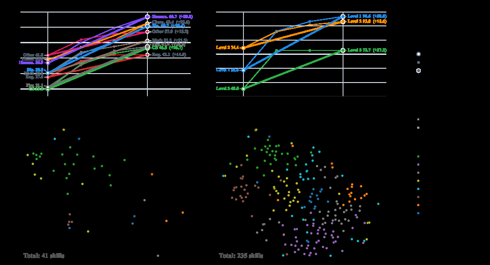

# Memento-Skills：让 Agent 设计可迁移 Agent 技能

> **保真度：核心机制复现**。本页不把确定性 mini-suite 冒充原论文完整 benchmark。

## 论文信息

| 字段 | 内容 |
|---|---|
| 论文链接 | [Memento-Skills：让 Agent 设计可迁移 Agent 技能（arXiv 2603.18743）](https://arxiv.org/abs/2603.18743) |
| 公司 / 机构 | Memento Team |
| 首次公开日期 | 2026-03-19（arXiv v1） |
| 原作者代码 | [已开源](https://github.com/Memento-Teams/Memento-Skills) |
| 本地 adapter / 方法键 | `memento-skills` |
| 本地复现代码 | [`src/auto_research/agent_research/`](https://github.com/daiwk/auto-research/tree/main/src/auto_research/agent_research/) |

## 原始论文总结

### 背景与主要改动

从执行日志反思出结构化技能说明，按任务检索并写回版本化技能，而不是原样堆叠轨迹。


<!-- paper-figure:start -->
### 原论文关键图

[](https://ar5iv.labs.arxiv.org/html/2603.18743/assets/x1.png)

> **原论文 Figure 1（关键图）**：展示原论文方法的总体设计和关键组成。图片来自[原论文](https://arxiv.org/abs/2603.18743)，版权归原作者所有；点击图片可查看来源。
<!-- paper-figure:end -->

### 核心公式

$$
s=\operatorname{Reflect}(\tau,R),\quad k^*=\arg\max_k\operatorname{sim}(x,k),\quad k\leftarrow\operatorname{Merge}(k,s).
$$

### 论文离线与线上效果

技术报告在多任务 agent suite 上展示技能抽取与跨任务迁移收益。 论文未报告生产线上 A/B，本页不补造线上数字。

## 本地复现

PlanBench mini-suite、120 episodes、seed 42：joint success **0.0500**，average cost 0.2800；方法特有操作有非零 telemetry。

```bash
auto-research agent-eval --method memento-skills --benchmark planbench-mini --episodes 120 --seed 42
auto-research evolve --model agent --dataset planbench-mini --direction "组合 memento-skills 与已安装论文算子" --generations 2 --population 4
```

固定指标见 [`../../experiments/global-p0-20260808-seed42.json`](../../experiments/global-p0-20260808-seed42.json)。

## 复现边界

本地只验证论文特有目标、状态更新和公平预算；没有复刻原论文的大模型、多卡 RL、私有环境、真实网页或完整 benchmark，因而只报告机制验证，不声称数值复现原表。
