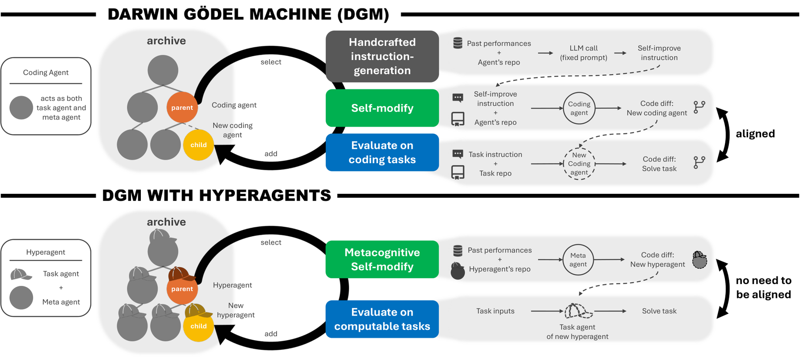

# HyperAgents

> **复现级别：L1 核心机制诊断。** 本地执行论文父代分布和有界结构化 archive step；禁止执行生成代码或 shell，因此只验证搜索控制机制，不声称复现自指代码修改能力。

## 论文信息

| 字段 | 内容 |
|---|---|
| 论文链接 | [arXiv](https://arxiv.org/abs/2603.19461) |
| 公司/机构 | University of British Columbia（按第一作者署名单位） |
| 首次公开日期 | 2026-03-19（arXiv v1） |
| 原文开源代码 | 是：[https://github.com/facebookresearch/hyperagents](https://github.com/facebookresearch/hyperagents) |
| Adapter | `hyperagents` |
| 本地复现代码 | [`src/auto_research/agent_research/official_meta_backfill_20261004.py`](https://github.com/daiwk/auto-research/tree/main/src/auto_research/agent_research/official_meta_backfill_20261004.py) |

## 原始论文总结

### 背景与主要改动

把任务 Agent 与修改它的 meta Agent 放入同一可编辑程序，并在开放档案中积累变体；父代概率同时奖励当前性能与较少后代的探索价值，使改进机制本身也可继续被改进。

<!-- paper-figure:start -->
### 原论文关键图

> **原论文 Figure 1（关键图）**：展示原论文提出的核心架构、主要模块及其连接关系。图片来自[原论文](https://arxiv.org/abs/2603.19461)，版权归原作者所有；点击图片可查看来源。
<!-- paper-figure:end -->

### 核心公式

$s_i=\sigma(\lambda(\alpha_i-\alpha_{mid}))$，$h_i=1/(1+n_i)$，$p_i=s_ih_i/\sum_j s_jh_j$。

### 论文离线与线上效果

论文在代码、论文评审、机器人 reward design 和 IMO 评分上展示开放式档案改进，并报告跨代形成评测分析、成本规划和持久记忆等元认知结构。

> 这些论文均未报告可归因于该方法的生产线上 A/B；上述数字是论文公开离线评测，不与本地诊断混写。

## 本地复现

- 三种子诊断：[`metrics/mechanism-seeds42-44.json`](metrics/mechanism-seeds42-44.json)
- 基线为机制关闭或默认状态；`diagnostic_only=true`，不进入正式能力排名。

## 复现边界

本地执行论文父代分布和有界结构化 archive step；禁止执行生成代码或 shell，因此只验证搜索控制机制，不声称复现自指代码修改能力。
