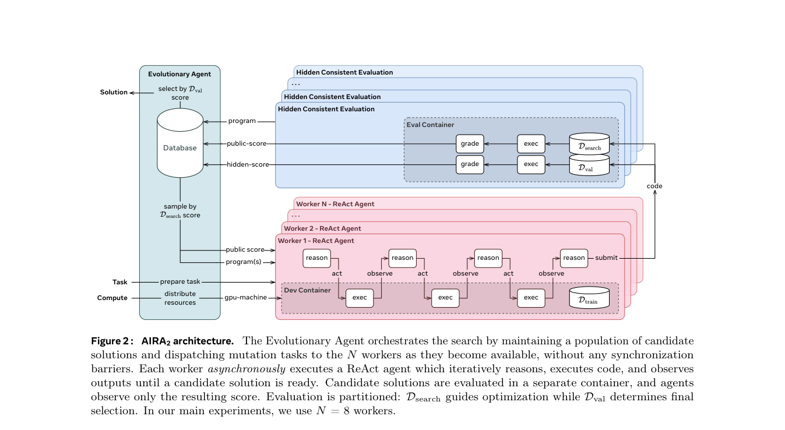

# AIRA2: Overcoming Bottlenecks in AI Research Agents

> **复现级别：L1 核心机制诊断。** 本地只执行异步调度与 HCE 信号隔离；未复刻 8×H200、Apptainer、Gemini ReAct operator 或论文长时训练，因此不是多 GPU 性能复现。

## 论文信息

| 字段 | 内容 |
|---|---|
| 论文链接 | [arXiv](https://arxiv.org/abs/2603.26499) |
| 公司/机构 | FAIR at Meta / University College London（按第一作者署名单位） |
| 首次公开日期 | 2026-03-27（arXiv v1） |
| 原文开源代码 | 否：截至 2026-10-04 未在论文、Meta 官方页或作者主页找到原作者公开实现 |
| Adapter | `aira2` |
| 本地复现代码 | [`src/auto_research/agent_research/official_meta_backfill_20261004.py`](https://github.com/daiwk/auto-research/tree/main/src/auto_research/agent_research/official_meta_backfill_20261004.py) |

## 原始论文总结

### 背景与主要改动

以无同步屏障的 steady-state worker pool 提高实验吞吐；训练、搜索、最终选择使用固定的 80/10/10 隐藏切分，搜索只看 search score，结束后才用未参与爬山的 validation 选冠军。

<!-- paper-figure:start -->
### 原论文关键图

> **原论文 Figure 2（关键图）**：展示原论文提出的核心架构、主要模块及其连接关系。图片来自[原论文](https://arxiv.org/abs/2603.26499)，版权归原作者所有；点击图片可查看来源。
<!-- paper-figure:end -->

### 核心公式

$p(i)\propto(N-r_i+1)^{1/T}$；$D_{train}$、$D_{search}$、$D_{val}$ 一次划分后跨候选保持一致，test signal 不进入本地接口。

### 论文离线与线上效果

论文 v2 在 MLE-bench-30 报告 24h/72h Percentile Rank 81.5%/83.1%，并在 AIRS-Bench 20 项任务中 6 项超过人工 SOTA。

> 这些论文均未报告可归因于该方法的生产线上 A/B；上述数字是论文公开离线评测，不与本地诊断混写。

## 本地复现

- 三种子诊断：[`metrics/mechanism-seeds42-44.json`](metrics/mechanism-seeds42-44.json)
- 基线为机制关闭或默认状态；`diagnostic_only=true`，不进入正式能力排名。

## 复现边界

本地只执行异步调度与 HCE 信号隔离；未复刻 8×H200、Apptainer、Gemini ReAct operator 或论文长时训练，因此不是多 GPU 性能复现。
