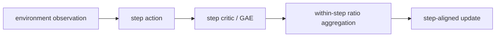
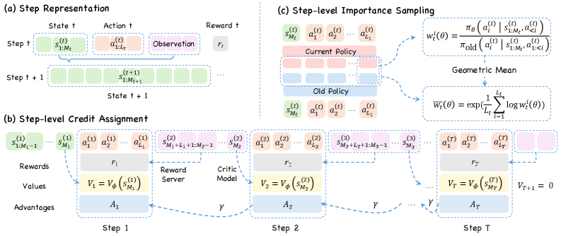

# StepPO：step-aligned Agent 策略优化

> 本页在公开候选策略或确定性 Agent mini-suite 上复现可隔离的 RL 更新机制；不把轻量实验写成原论文规模模型或 benchmark 结论。

## 论文信息

| 字段 | 内容 |
|---|---|
| 论文链接 | [StepPO：step-aligned Agent 策略优化（arXiv 2604.18401）](https://arxiv.org/abs/2604.18401) |
| 公司 / 机构 | University of Science and Technology of China 作者团队 |
| 首次公开日期 | 2026-04-20 |
| 原作者代码 | 未发现官方代码 |
| 本地 adapter / 算法键 | `steppo` |
| 本地复现代码 | [`src/auto_research/agent_research/`](https://github.com/daiwk/auto-research/tree/main/src/auto_research/agent_research/) |

## 原始论文总结

### 背景与主要改动

Agent 的自然决策单位是“观察—动作”的 environment step，token-level MDP 会让动作粒度和信用粒度错位。StepPO 将交互重写为 step-level MDP，在 step boundary 估值和做 GAE，并把 step 内 token ratio 聚合后再裁剪。



<!-- paper-figure:start -->
### 原论文关键图

[](https://arxiv.org/html/2604.18401v4/x3.png)

> **原论文 Figure 3（关键图）**：展示原论文方法的总体设计和关键组成。图片来自[原论文](https://arxiv.org/abs/2604.18401)，版权归原作者所有；点击图片可查看来源。
<!-- paper-figure:end -->

### 核心公式

$$
\hat A_t^{\rm step}=\sum_{l\ge0}(\gamma\lambda)^l\delta_{t+l},\qquad r_t^{\rm step}=\exp\!\left(\frac1{|\mathcal T_t|}\sum_{j\in\mathcal T_t}\log r_j\right).
$$

### 论文离线与线上效果

论文在 multi-hop QA、论文搜索和 text-world action 任务上报告持续超过多种 token-centric RL 基线；未报告线上 A/B。

## 本地复现

在 PlanBench mini 的每个环境动作边界执行 step value、step GAE 与 step sequence-ratio clip，并公开对应诊断计数。

```bash
auto-research agent-eval --method steppo --benchmark planbench-mini --episodes 120 --seed 42
```

固定 seed 汇总指标见 [`rl-papers-summary-seed42.json`](../../experiments/rl-papers-summary-seed42.json)。

## 复现边界

本地 action 是确定性工具计划，不含真实 LLM token generation；验证的是 step 对齐状态机而非论文规模的 agent 训练。
