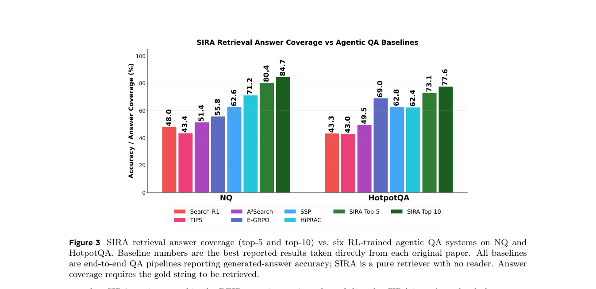

# Superintelligent Retrieval Agent: The Next Frontier of Agentic Retrieval

> **复现级别：L1 核心机制诊断。** 本地执行 DF gate 与加权单次检索组合，不调用论文 LLM、不重建 2558 万文档索引，也不把公开离线结果写成线上 A/B。

## 论文信息

| 字段 | 内容 |
|---|---|
| 论文链接 | [arXiv](https://arxiv.org/abs/2605.06647) |
| 公司/机构 | Meta Superintelligence Labs / Rice University（工作完成于 Meta）（按第一作者署名单位） |
| 首次公开日期 | 2026-05-07（arXiv v1） |
| 原文开源代码 | 是：[https://github.com/facebookresearch/sira](https://github.com/facebookresearch/sira) |
| Adapter | `sira` |
| 本地复现代码 | [`src/auto_research/agent_research/official_meta_backfill_20261004.py`](https://github.com/daiwk/auto-research/tree/main/src/auto_research/agent_research/official_meta_backfill_20261004.py) |

## 原始论文总结

### 背景与主要改动

冻结 LLM 先生成相关证据可能使用、但原查询缺失的词汇，再用倒排索引中的文档频率过滤不存在或过于常见的词；原查询与验证后的扩展只执行一次加权 BM25。

<!-- paper-figure:start -->
### 原论文关键图

> **原论文 Figure 3（关键图）**：展示原论文的整体流程、关键阶段及其数据流向。图片来自[原论文](https://arxiv.org/abs/2605.06647)，版权归原作者所有；点击图片可查看来源。
<!-- paper-figure:end -->

### 核心公式

$score(d)=BM25(q_{orig},d)+w\,BM25(q_{exp},d)$；查询侧词项需满足 $0<DF(t)\le\tau|C|$。

### 论文离线与线上效果

十个 BEIR 任务平均检索表现优于论文所比稠密、学习式稀疏及 Agent 检索基线；BrowseComp-Wikipedia 的 Recall@1/10/100 分别为 9.70%/15.27%/36.14%。

> 这些论文均未报告可归因于该方法的生产线上 A/B；上述数字是论文公开离线评测，不与本地诊断混写。

## 本地复现

- 三种子诊断：[`metrics/mechanism-seeds42-44.json`](metrics/mechanism-seeds42-44.json)
- 基线为机制关闭或默认状态；`diagnostic_only=true`，不进入正式能力排名。

## 复现边界

本地执行 DF gate 与加权单次检索组合，不调用论文 LLM、不重建 2558 万文档索引，也不把公开离线结果写成线上 A/B。
