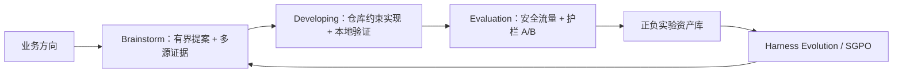
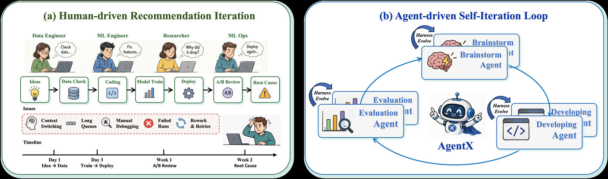

# AgentX：工业推荐系统的 Agent 驱动自迭代

> **复现级别：核心闭环 mini-suite。** 本地实现 Brainstorm、Developing、Evaluation 与 Harness Evolution 四阶段控制流，并验证实验知识复用带来的执行成本下降。

## 论文信息

| 字段 | 内容 |
|---|---|
| 论文链接 | [arXiv 2606.26859](https://arxiv.org/abs/2606.26859) |
| 公司 / 机构 | Kuaishou（论文署名 AgentX Team） |
| 首次公开日期 | 2026-06-26（arXiv v1） |
| 原作者代码 | 否：截至 2026-08-24 未发现作者公开实现 |
| 本地 adapter / 方法 | `agentx` |
| 本地复现代码 | [`src/auto_research/agent_research/latest_20260824.py`](https://github.com/daiwk/auto-research/blob/main/src/auto_research/agent_research/latest_20260824.py) |

## 原始论文总结

### 背景与主要改动

传统推荐迭代需要工程师串联假设、生产代码、上线 A/B 和归因，经验也难以跨实验积累。AgentX 将流程改造成四阶段闭环：Brainstorm Agent 从实验库、系统知识、数据分析和外部论文生成有证据的候选；Developing Agent 在仓库约束下实现并验证；Evaluation Agent 用护栏否决的线上 A/B 判断；最后以 SGPO 从成功与失败轨迹更新 Agent harness。



<!-- paper-figure:start -->
### 原论文关键图

[](https://arxiv.org/html/2606.26859v2/figures/Agentx_introduction.png)

> **原论文 Figure 1（关键图）**：展示原论文的整体流程、关键阶段及其数据流向。图片来自[原论文](https://arxiv.org/abs/2606.26859)，版权归原作者所有；点击图片可查看来源。
<!-- paper-figure:end -->

### 核心公式

候选提案按目标一致性、业务有效性、可实现性、交付完整性和证据加权，并扣除风险：

$$
E(c\mid q)=\sum_{k\in\mathcal K}\alpha_k(q,c)e_k(c),\qquad
S(c\mid q)=\lambda_oO+\lambda_bB+\lambda_fF+\lambda_hH+\lambda_eE-\lambda_rR.
$$

线上判定不是单指标最大化：主指标显著改善后，任一关键护栏越界都可否决发布；无论成功或失败，执行轨迹都会进入实验知识库，成为下一轮提案和 harness 更新的证据。

### 论文离线与线上效果

论文报告在 Kuaishou App 主信息流与本地生活推荐进行了三周生产部署：3 个 worker 将 374 个想法收敛为 10 个可上线实验；并发能力为人工流程的 `8×`，单 worker 每周吞吐翻倍，业务价值为人工工程师的 `3.7×`。已上线实验带来用户 App 时长 `+0.561%`，折算年化收入超过人民币 1 亿元。这是生产全闭环证据，不只是离线 benchmark。

## 本地复现

在 `planbench-mini` 的 120 个确定性 episode 上，12 类首次任务完整经过提案、开发、双重本地验证、全局护栏判断、资产化与策略更新；后续 108 个 episode 从实验知识库复用方案。最终 joint success 为 `1.0000`，平均代理成本为 `0.5870`。

| 指标 | 本地结果 |
|---|---:|
| joint success | 1.0000 |
| 首次闭环 / 知识复用 | 12 / 108 |
| bounded proposal explorations | 36 |
| local / global verifier calls | 132 / 120 |
| archival writes / policy updates | 12 / 120 |
| average proxy cost | 0.5870 |

稳定指标见 [`metrics/planbench-mini-seed42.json`](metrics/planbench-mini-seed42.json)，本批次统一索引见 [`../../experiments/recent-papers-20260824-seed42.json`](../../experiments/recent-papers-20260824-seed42.json)。

```bash
auto-research agent-eval --method agentx --benchmark planbench-mini \
  --episodes 120 --memory-size 24 --seed 42
```

## 复现边界

本地没有 Kuaishou 内部仓库、流量平台、线上用户或 SGPO 大模型训练，因此不能复现论文的业务增益。mini-suite 验证的是四阶段闭环、正负结果资产化、验证门槛与跨 episode 复用；`average proxy cost` 仅是控制流成本，不冒充人效、收入或线上时长。
