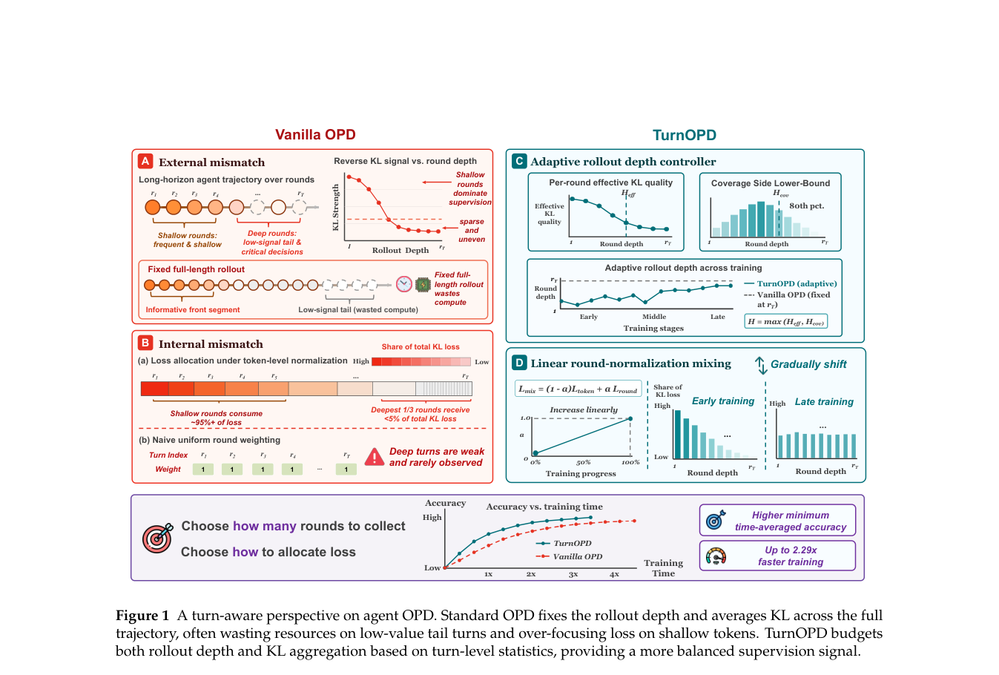

# TurnOPD：面向长程 Agent 的 Turn-Aware OPD

> 保真度：实现论文可隔离的核心状态与更新机制，并在统一公开数据或确定性
> mini-suite 上运行；不把轻量机制实验写成原规模大模型复现。

## 论文信息

| 字段 | 内容 |
|---|---|
| 论文链接 | [TurnOPD：面向长程 Agent 的 Turn-Aware OPD（arXiv 2607.05804）](https://arxiv.org/abs/2607.05804) |
| 公司 / 机构 | Academic author team |
| 首次公开日期 | 2026-07-07 |
| 原作者代码 | 截至 2026-07-29 未发现官方公开仓库 |
| 本地 adapter / 算法键 | `turn-opd` |
| 本地复现代码 | [`src/auto_research/agent_research/`](https://github.com/daiwk/auto-research/tree/main/src/auto_research/agent_research/) |

## 原始论文总结

### 背景与主要改动

用 probe 统计自适应决定 rollout 深度，并逐步把 token KL 预算迁移为 turn-normalized 监督。


<!-- paper-figure:start -->
### 原论文关键图

[](https://arxiv.org/pdf/2607.05804#page=2)

> **原论文 Figure 1（关键图）**：展示原论文方法的总体设计和关键组成。图片来自[原论文](https://arxiv.org/abs/2607.05804)，版权归原作者所有；点击图片可查看来源。
<!-- paper-figure:end -->

### 核心公式

$$
L^\star=\operatorname{Budget}(\hat I_1,\ldots,\hat I_T),\quad \mathcal L=\sum_{t\le L^\star}\frac{1}{|y_t|}\mathrm{KL}(\pi_\theta^t\Vert\pi_T^t).
$$

### 论文离线与线上效果

在 ALFWorld、WebShop 和 Multi-Hop Search 的等墙钟预算下提高验证准确率，并推进 accuracy-time 前沿。 论文没有报告生产线上 A/B，因此本站只保留离线/环境评测口径。

## 本地复现

ScaleMCP mini-suite 中执行深度 probe、动态截断和 turn 归一化，记录节省的 rollout turns。

| 指标 | TurnOPD |
|---|---:|
| joint success | 1.0000 |
| average cost | 1.3333 |
| rollout turns saved | 40 |

```bash
auto-research agent-eval --method turn-opd --episodes 120 --seed 42
```

固定 seed 指标见
[`agent-20260729-seed42.json`](../../experiments/agent-20260729-seed42.json)。

## 复现边界

教师行为由确定性任务 oracle 提供；没有运行任务专用大模型教师。
