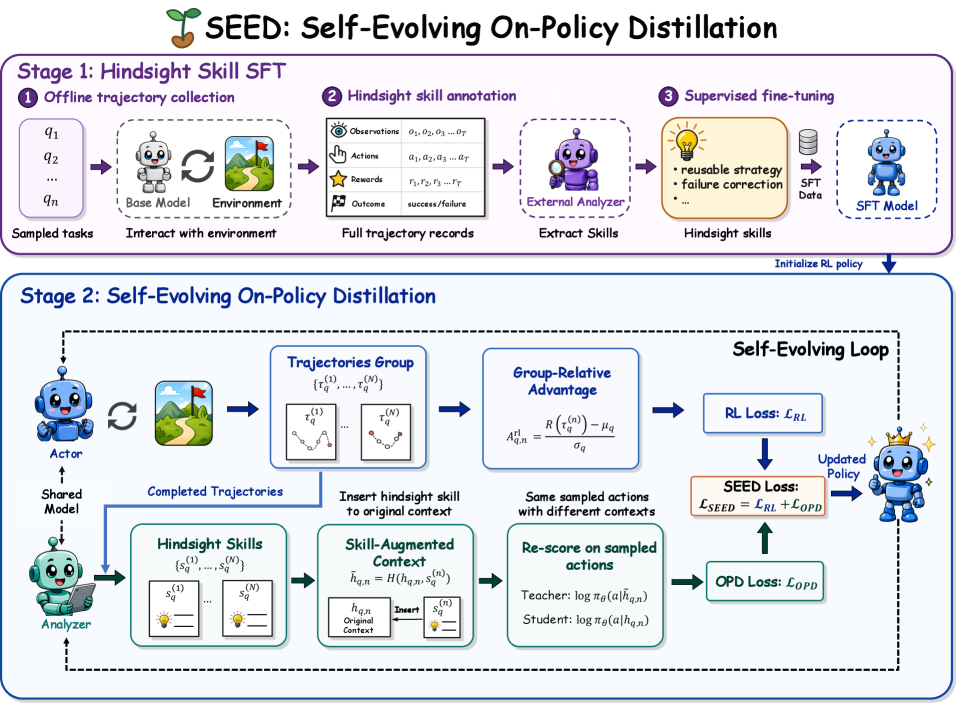

# SEED：自进化 On-Policy Distillation

> 保真度：实现论文可隔离的核心状态与更新机制，并在统一公开数据或确定性
> mini-suite 上运行；不把轻量机制实验写成原规模大模型复现。

## 论文信息

| 字段 | 内容 |
|---|---|
| 论文链接 | [SEED：自进化 On-Policy Distillation（arXiv 2607.14777）](https://arxiv.org/abs/2607.14777) |
| 公司 / 机构 | Tsinghua University / Zhejiang University / CUHK / NTU / Tongji University |
| 首次公开日期 | 2026-07-16 |
| 原作者代码 | [已开源](https://github.com/jinyangwu/SEED) |
| 本地 adapter / 算法键 | `seed` |
| 本地复现代码 | [`src/auto_research/agent_research/`](https://github.com/daiwk/auto-research/tree/main/src/auto_research/agent_research/) |

## 原始论文总结

### 背景与主要改动

从已完成轨迹中反思出可复用 hindsight skill，再用 skill 条件前后的动作概率变化形成稠密 on-policy 蒸馏信号。


<!-- paper-figure:start -->
### 原论文关键图

[](https://arxiv.org/html/2607.14777v1/x3.png)

> **原论文 Figure 2（关键图）**：展示原论文方法的总体设计和关键组成。图片来自[原论文](https://arxiv.org/abs/2607.14777)，版权归原作者所有；点击图片可查看来源。
<!-- paper-figure:end -->

### 核心公式

$$
r_t^{\mathrm{skill}}=\log\pi_\theta(a_t\mid s_t,z)-\log\pi_\theta(a_t\mid s_t),\quad \mathcal L=\mathcal L_{\mathrm{RL}}+\lambda\mathcal L_{\mathrm{OPD}}.
$$

### 论文离线与线上效果

论文在文本和视觉 Agent 任务上报告一致的性能与样本效率提升，并测试未见场景泛化。 论文没有报告生产线上 A/B，因此本站只保留离线/环境评测口径。

## 本地复现

在 PlanBench mini-suite 中把成功/失败轨迹压缩为 hindsight skill，并记录 skill 数量、稠密 credit 更新和跨 episode 复用。

| 指标 | SEED |
|---|---:|
| joint success | 1.0000 |
| average cost | 0.9800 |
| hindsight skills / dense credit updates | 12 / 360 |

```bash
auto-research agent-eval --method seed --episodes 120 --seed 42
```

固定 seed 指标见
[`agent-20260729-seed42.json`](../../experiments/agent-20260729-seed42.json)。

## 复现边界

使用确定性任务与结构化 skill，不执行视觉模型或大规模策略梯度训练。
