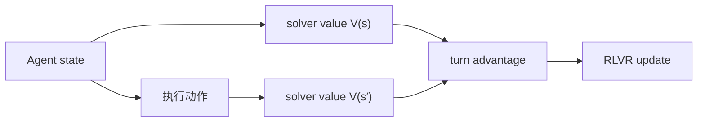
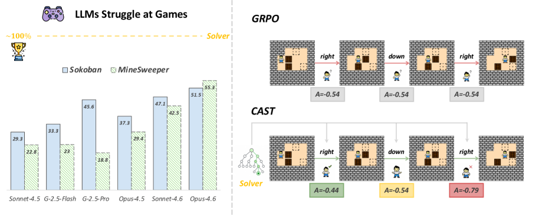

# CAST：用游戏求解器提供 Turn 级教师信号

> 保真度：实现论文可隔离的核心状态与更新机制，并在统一公开数据或确定性
> mini-suite 上运行；不把轻量机制实验写成原规模大模型复现。

## 论文信息

| 字段 | 内容 |
|---|---|
| 论文链接 | [CAST：用游戏求解器提供 Turn 级教师信号（arXiv 2607.25308）](https://arxiv.org/abs/2607.25308) |
| 公司 / 机构 | USTC / Nanjing University / Wuhan University |
| 首次公开日期 | 2026-07-28 |
| 原作者代码 | [已开源](https://github.com/Wloner0809/CAST) |
| 本地 adapter / 算法键 | `cast` |
| 本地复现代码 | [`src/auto_research/agent_research/`](https://github.com/daiwk/auto-research/tree/main/src/auto_research/agent_research/) |

## 原始论文总结

### 背景与主要改动

把求解器状态价值的相邻差分变成 solver advantage，为稀疏结果奖励补充 turn 级 credit。



<!-- paper-figure:start -->
### 原论文关键图

[](https://arxiv.org/html/2607.25308v1/x1.png)

> **原论文 Figure 1（关键图）**：展示原论文方法的总体设计和关键组成。图片来自[原论文](https://arxiv.org/abs/2607.25308)，版权归原作者所有；点击图片可查看来源。
<!-- paper-figure:end -->

### 核心公式

$$
A_t^{\mathrm{solver}}=V_{\mathrm{solver}}(s_{t+1})-V_{\mathrm{solver}}(s_t),\quad A_t=A^{\mathrm{outcome}}+\lambda A_t^{\mathrm{solver}}.
$$

### 论文离线与线上效果

在 Sokoban、Minesweeper、Rush Hour 的域内和未见难度上超过训练基线，并在 ALFWorld、WebShop 获得最高平均零样本表现。 论文没有报告生产线上 A/B，因此本站只保留离线/环境评测口径。

## 本地复现

PlanBench mini-suite 的确定性最短路充当 solver，逐 turn 查询状态值并统计 credit update。

| 指标 | CAST |
|---|---:|
| joint success | 1.0000 |
| average cost | 1.5000 |
| solver queries / turn credit updates | 2040 / 360 |

```bash
auto-research agent-eval --method cast --episodes 120 --seed 42
```

固定 seed 指标见
[`agent-20260729-seed42.json`](../../experiments/agent-20260729-seed42.json)。

## 复现边界

没有复刻论文三类游戏的大规模 LLM RLVR；求解器准确，适合验证 credit assignment 而非模型能力。
